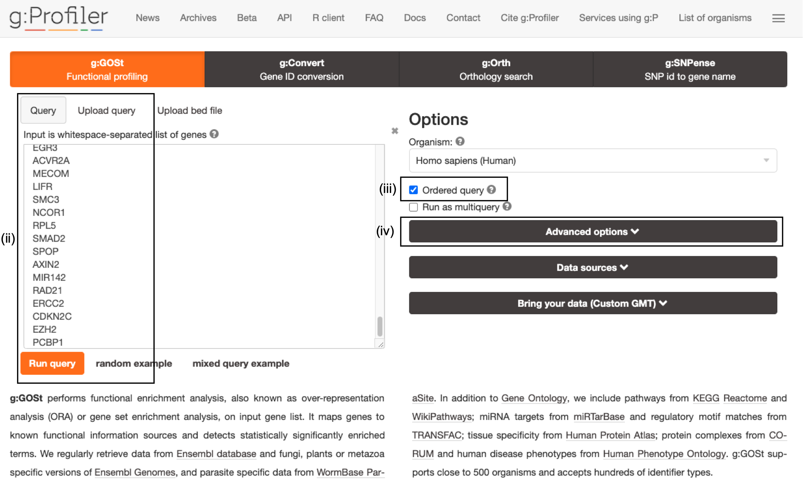
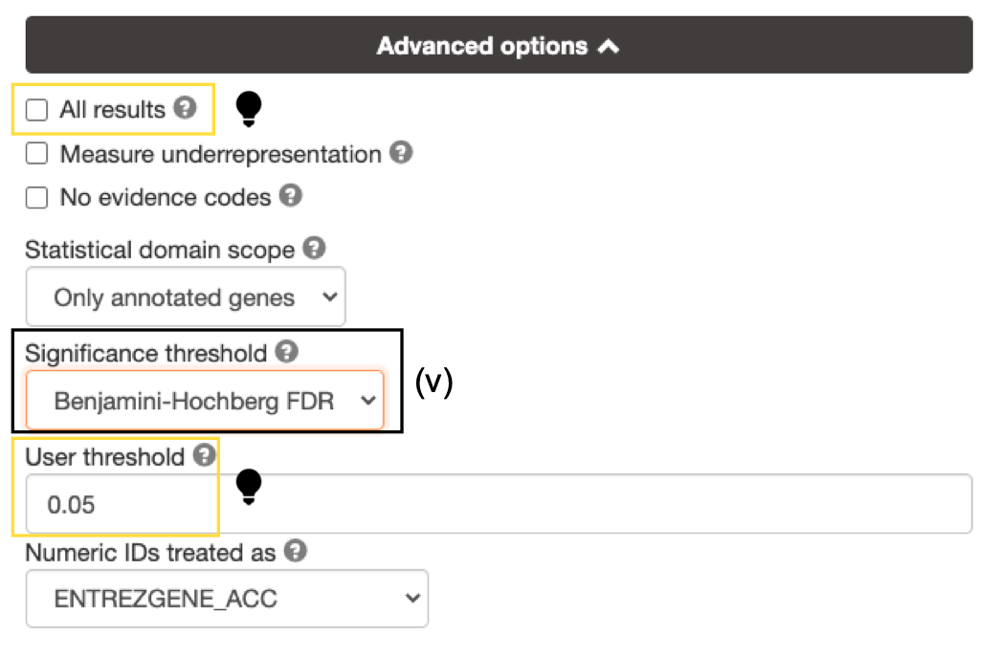
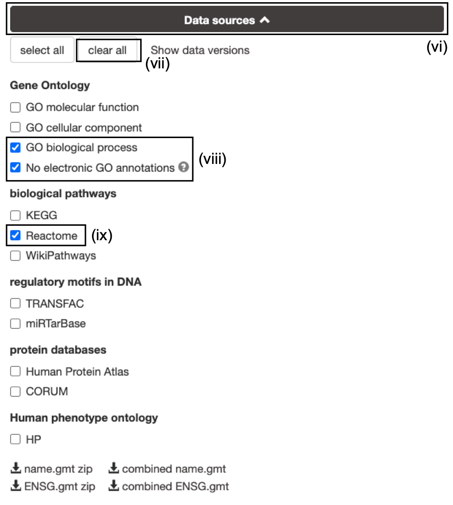
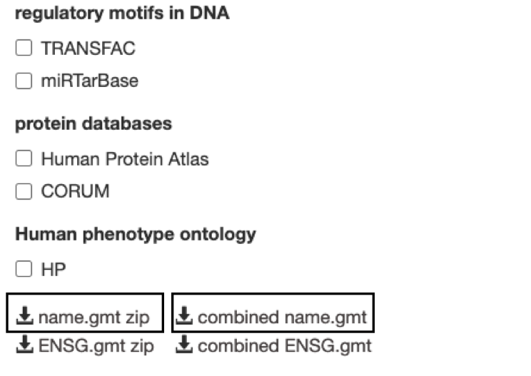
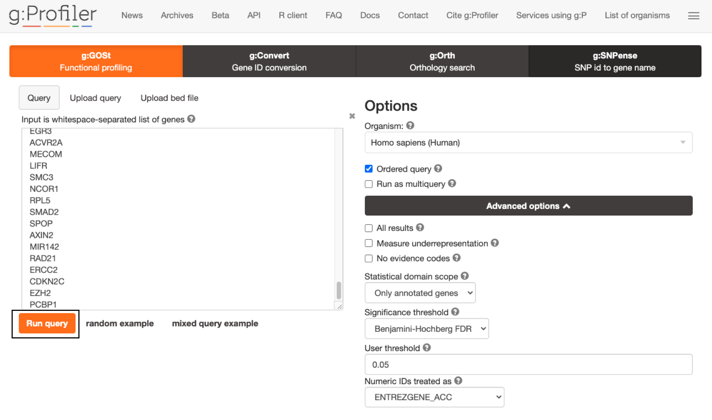
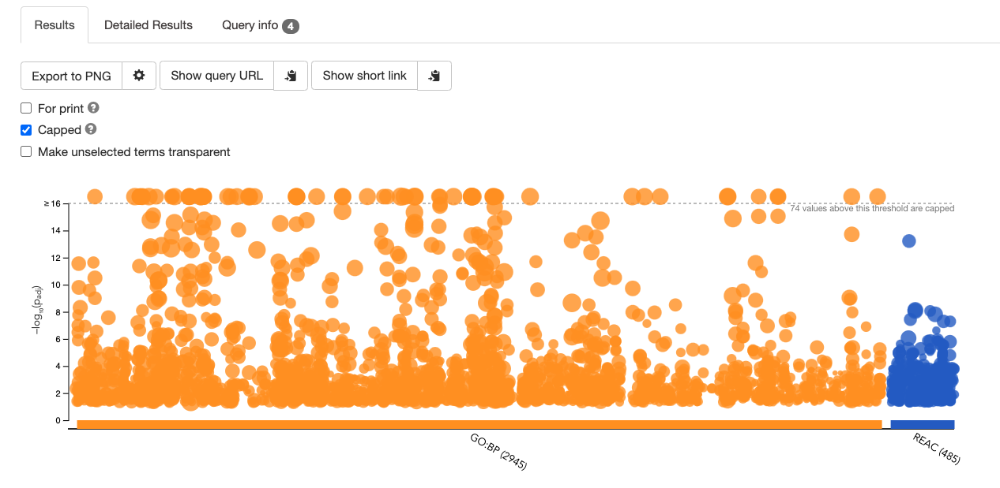
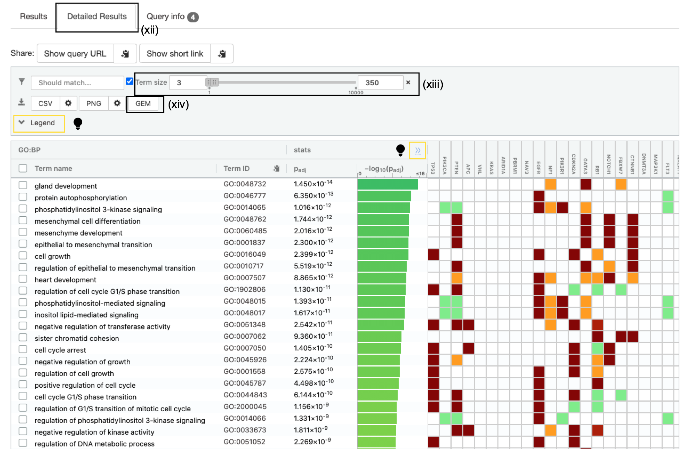

# (6A) Gene list using g:Profiler {#gprofiler-enrich}

## Specify parameters

  i. Open the g:Profiler website at [g:Profiler](https://biit.cs.ut.ee/gprofiler/gost).
  i. Paste the gene list ([Supplementary_Table1_Cancer_drivers.txt](./data/Supplementary_Table1_Cancer_drivers.txt)) into the Query field in top-left corner of the screen. 
  i. Check the box next to Ordered query. This option treats the input as an ordered gene list and prioritizes genes with higher mutation ESs at the beginning of the list.
  i. Click on *Advanced Options* to set additional parameters.
  
  

```{block, type="rmd-note"}
The gene list can be space-separated or one per line. The organism for the analysis, Homo sapiens, is selected by default. The input list can contain a mix of gene and protein IDs, symbols and accession numbers. Duplicated and unrecognized IDs will be removed automatically, and ambiguous symbols can be refined in an interactive dialogue after submitting the query. 
```

```{block, type="rmd-tip"}
open the file in a simple text editor such as Notepad or Textedit to copy the list of genes.  
```

<p align="center">
  
 </p>

<ol start=5 type="i">
<li> Set *Significance threshold* to "Benjamini-Hochberg FDR".
</ol>

<br><br><br><br><br>

```{block, type="rmd-tip"}
if g:Profiler does not return any results:

  * increase the *User threshold* (0.1, then 1) to check that g:Profiler is running successfully but there are simply no significant results for your query. 
  * Alternately, click on *All results* to return all enrichments irrespective of significance. 
```

<p align="center">
  
 </p>

<ol start=6 type="i">
<li> Click on the *Data sources* tab (black rectangle) to expand it.</li>
<li> UnSelect the following gene-set databases by clicking the "clear all" button.</li>
<li>In the *Gene Ontology* category, check  *GO Biological Process* and *No electronic GO annotations*.</li>
<li> In the *biological pathways* category, check *Reactome*.</li>
</ol>
 
<br><br>

```{block, type="rmd-note"}
*No electronic GO annotations* option will discard less reliable GO annotations (IEAs) that are not manually reviewed.
```

```{block, type="rmd-tip"}
if g:Profiler does not return any results uncheck the *No electronic GO annotation* option to expand annotations used in the test.
```


---

## Downlaod GMT

<p align="center">
  
</p>

  * Optional but recommended: Download the required GMT pathway database file.

  * Click on the 'combined name.gmt' link located at bottom of the dataset tab. It will download a file named *combined name.gmt* containing a pathway database GMT file with all the available sources. 

  * (Optional) concatenate the GO:BP and Reactome gmt files:

If you want to create a smaller gmt file that doesn't contain all of the gprofiler datasources you can instead download name.gmt.zip that contains each datasource as its own GMT file.  You will need to concatenate the sources you require into one GMT file to use for later.

#### Option 1: Merge manually, if you are not familiar with unix commands
   * open a text editor such a Notepad or equivalent
   * open hsapiens.GO:BP.name.gmt using the text editor
   * open gmt hsapiens.REAC.name.gmt using the text editor
   * copy-paste all the rows from REAC file together with all the rows in GO:BP file and save it as hsapiens.pathways.name.gmt .

#### Option 2: using the cat command if you are familiar with unix commands
   * open your terminal window
   * cd to the unzipped gprofiler_hsapiens.name folder
   * type the following command: 
   ```
    cat hsapiens.GO:BP.name.gmt hsapiens.REAC.name.gmt > hsapiens.pathways.name.gmt
   ``` 

```{block, type="rmd-note"}
you will be using this optional hsapiens.pathways.name.gmt file in Cytoscape EnrichmentMap.
```     

---

## Run Query

<ol start=11 type="i">
<li> Click *Run Query* to run the analysis. The *Run Query* button will change to *Run Query ...* while it is running and *Run Query &check;* when the query is complete.  The &check; will only remain there momentarily and then return to *Run Query* button. </li>
</ol>




```{block, type="rmd-tip"}
If you miss the button changing from "..." to &check; it might appear that nothing has happened.  Scroll down to see results.
```

A graphical map of the resulting pathways will be shown, with the -log10(pvalue) along the y axis and the associated pathways of the input list shown along the x axis divided by datasource.  By default, results with Q values <0.05 are reported but all pathways are shown in the graphical map with a dotted line indicating which pathways are significant and pass correction.


```{block, type="rmd-tip"}
Mousing over any of the dots will display the source identifier, pathway name and associated p-value.
```

## Filter enrichment results

<ol start=12 type="i">
<li> Click *Detailed Results* tab to see detailed results.  </li>
</ol>

A graphical heat map image will be shown, with detected pathways shown along the y axis (left) and associated genes of the input list shown along the x axis (top). Resulting pathways are listed by p-value.  g:Profiler returns only statistically significant pathways with P values adjusted for multiple testing correction (called Q values). By default, results with Q values <0.05 are reported. g:Profiler reports unrecognized and ambiguous gene IDs that can be resolved manually. 

```{block, type="rmd-tip"}
For GO pathways and gene sets the boxes under each gene will be filled with different colours.  The different colours represent different evidence codes.  To see the legend specifying what each colour represents click on legend drop down above heatmap.  
```



<ol start=13 type="i">
<li> Set the *Term Size* slider to minimum 3 and maximum 350. The analysis will consider only more reliable pathways that have three or more genes and no more than 350.  </li>
</ol>

```{block, type="rmd-tip"}
To see the specific numbers used to calculate the statistics for each gene set click on the ">>" in the header of the heatmap.  This will add T (number of genes associated with the term), Q (number of genes in the query) , T intersect Q (the number of genes found in both the term and the query), U (the number of genes in the universe).  
```

```{block, type="rmd-tip"}
If *ordered query* is selected then the number of query genes associated with each pathway will fluctuate as g:Profiler sequenctially increases the number of genes tested and finds the set of genes that generate the most significant result. 
```

## Downlaod Enrichment File
<ol start=14 type="i">
<li> Click on the option *GEM* (Generic Enrichment Map). This file is required for visualizing pathway results with Cytoscape and EnrichmentMap.</li>
</ol>
