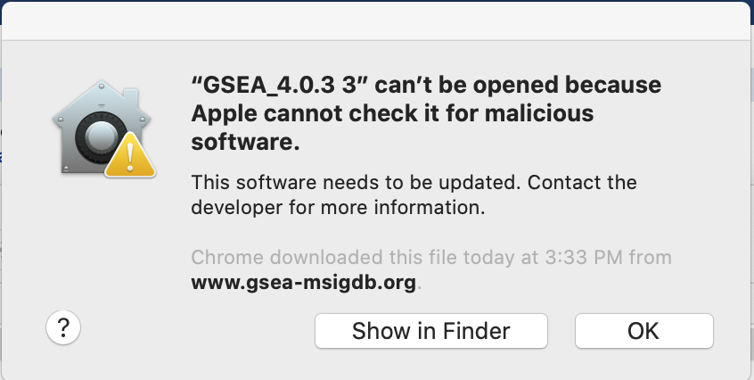

# (6B) Ranked gene list using GSEA {#gsea-enrich}

## Loading the required data files into GSEA {#gsea_ts1}

  i. Launch GSEA by double clicking on the installed Application.

```{block, type="rmd-troubleshooting"} 
**Unable to launch GSEA**

When launching GSEA on macOS for the first time, you may get the error ‘gsea.jnlp cannot be opened because it is from an unidentified developer’. 

Follow instructions specified on download page:


  * If you see this error message:
  
  

  * Open Settings -> Security & Privacy
  * Click on "Open Anyways"

  

If GSEA still fails to launch, GSEA can alternatively be launched from the command line. 

  * Go to the GSEA download site (http://www.broadinstitute.org/gsea/downloads.jsp) and download the javaGSEA JAR file (the second option on the download site). 
  * Open a command-line terminal. 
    * On macOS, the terminal can be found in Applications → Utilities → Terminal. 
    * On Windows, type ``cmd`` in the Windows program files search bar. 
  * Then navigate to the directory where the file javaGSEA.jar was downloaded, using the command cd. For example, on macOS run cd ~/Downloads if you downloaded the GSEA.jar file to your Downloads folder. 
  * Run the command java –Xmx4G –jar gsea-3.0.jar, where –Xmx specifies how much memory is given to GSEA.
```
<br><br>
<p align="center">
  
 </p>

<ol start=2 type="i">
<li> Click on *Load Data* in the top left corner of the *Steps in GSEA Analysis* section.</li>
<li>In the *Load Data* tab, click on *Browse for files …*</li>
<li>Load your ranked genes and GMT file</li>
</ol>

   * Find your project data folder and select the [Supplementary_Table2_MesenvsImmuno_RNASeq_ranks.rnk](./data/Supplementary_Table2_MesenvsImmuno_RNASeq_ranks.rnk) file. 
   * Also select the pathway gene set definition (GMT), [Supplementary_Table3_Human_GOBP_AllPathways_no_GO_iea_July_01_2017_symbol.gmt](./data/Supplementary_Table3_Human_GOBP_AllPathways_no_GO_iea_July_01_2017_symbol.gmt) file using a multiple-select method such as shift-click. 
  
   * Click the Choose button to continue. 
   * A message box indicates that the files were loaded successfully. 

   * Click the OK button to continue.

```{block, type="rmd-troubleshooting"}
**GSEA seems non-responsive**
It may take 5–10 s for GSEA to load input files. The files are loaded successfully once a message appears on the screen, e.g., ‘Files loaded successfully: 2/2. There were no errors’
```

```{block, type="rmd-tip"}
Alternatively, you can choose **Method 3** to **drag and drop files here**; you need to click on the **Load these files!** button in this case.
```

```{block, type="rmd-note"}
**Creating your own files for GSEA**

GSEA has a useful help documentation on file formats available at https://software.broadinstitute.org/cancer/software/gsea/wiki/index.php/Data_formats

```


## Specifying parameters

<ol start=5 type="i">
<li> Click on *Run GSEAPreranked* in the side bar under Tools. The *Run GSEA on a Pre-Ranked gene list* tab will appear.</li>
<li>*Gene sets database*. Click on the button ‘(…)’ located to the right and wait a few seconds for the gene set selection window to appear.  </li>
</ol>

  * Go to the Gene matrix (local gmx/gmt) tab by using the top right arrow. 
  * Click on the downloaded local GMT file, ‘Supplementary_Table3_Human_GOBP_AllPathways_no_GO_iea_July_01_2017_symbol.gmt’.

  * click on OK at the bottom of the window.

```{block, type="rmd-note"}
**GMT files**

GSEA also supplies its own gene set files, which are accessible directly through the GSEA interface from the MSigDB resource[@msigdb, @hallmark]. These files do not need to be imported into GSEA. To define the GMT file, find the MSigDB gene set files in the first tab, Gene Matrix (from website), of the Select one or more genesets dialog. The latest versions of the MSigDB gene set files are shown in bold, but the earlier versions can also be accessed. To select multiple gene set files, click on the desired files while holding the control key in Windows or the command key in macOS.

```


<ol start=7 type="i">
<li>*Number of permutations*. This specifies the number of times that the gene sets will be randomized to create the null distribution to calculate the P value and FDR Q value. Use the default value of 1,000 permutations.</li>
</ol>
```{block, type="rmd-note"}
Higher numbers of permutations require longer computation times. To calculate the FDR Q value for each gene set, the dataset is randomized by permuting the genes in each gene set and recalculating the P values for the randomized set. This parameter specifies how many times this randomization is done. The more randomizations are performed, the more precise the FDR Q value estimation will be (to a limit, as eventually the FDR Q value will stabilize at the actual value). On a Windows machine with 16 G of RAM and an i7 3.4-GHz processor, an analysis with 10, 100, 500 or 1,000 randomizations on our example set with the above defined parameters takes 155, 224, 544, and 1,012 s, respectively.
```

<ol start=8 type="i">
<li>*Ranked List* - Select the ranked gene list by clicking on the right-most arrows and highlighting the rank file [Supplementary_Table2_MesenvsImmuno_RNASeq_ranks.rnk](./data/Supplementary_Table2_MesenvsImmuno_RNASeq_ranks.rnk).</li>
<li>*Collapse/Remap to gene symbols* - Change to *No_collapse*.  (Our rank file already contains the gene symbols so we don't need GSEA to try and convert probe names to gene symbols)</li>
<li>Click the *Show* button next to *Basic fields* to display additional options.</li>
<li>*Analysis name*. Change the default ‘my_analysis’ to a specific name, for example, ‘Mesen_vs_Immuno’.</li>
<li>*Max size:* exclude larger sets. By default, GSEA sets the upper limit to 500. Set this to **200** to remove the larger sets from the analysis.</li>
<li>*Save results in this folder*. Navigate to the folder where GSEA should save the results. We recommend you choose the *result data folder* created in Step 1. Otherwise, GSEA will use the default location ‘gsea_home/output/[date]’ in your home directory.</li>
</ol>

```{block, type="rmd-tip"}
set **Enrichment Statistics** to p2 if you want to add more weight on the most top up-regulated and top down-regulated. **P2** is a more stringent parameter and it will result in less gene-sets significant under FDR <0.05.
```

## Running GSEA

<ol start=14 type="i">
<li>Run GSEA by clicking on the *Run* button located at the bottom of the window. Expand the window if the button is not visible. The GSEA reports pane at the bottom left of the window will show the status ‘Running’. It will be updated to ‘Success’ upon completion. This is expected to be a long-running process, depending on the speed of your computer.</li>
</ol>

```{block, type="rmd-tip"}
**GSEA looks non-responsive, but it is actually computing enrichments**

GSEA has no progress bar to indicate estimated time to completion. A run can take a few minutes or hours, depending on the size of the data and the computer speed. 

  * Click on the ‘+’ in the bottom left corner of the screen to see messages such as ‘shuffleGeneSet for GeneSet 76/4714 nperm: 1000’ . This message indicates that GSEA is shuffling 4,714 gene sets 1,000 times each, 76 of which are complete. Once the permutations are complete, GSEA generates the report
  
  
```

```{block, type="rmd-troubleshooting"}
**Error message 'Java Heap space'**

The error message ‘Java Heap space’ indicates that the software has run out of memory. Another version of GSEA is needed if you are running the GSEA desktop application. There are multiple options available for download from the GSEA website. You can download a webstart application that launches GSEA with 1, 2, 4 or 8 GB of RAM. Upgrade to a webstart that launches with more memory. If you are already using the webstart that launches with 8 GB, then you require a GSEA JAVA .jar file, which can be executed from the command line with increased memory (see [Troubleshooting for Step 6B(i)](#gsea_ts1) for details)

```

## Examining GSEA results

<ol start=15 type="i">
<li>Once the GSEA analysis is complete, a green notification ‘Success’ will appear in the bottom left section of the screen. </li>
</ol>

 

   * All GSEA output files will be automatically saved and be available in the folder you specified in the GseaPreranked interface (Step 6B(xiii)). 
  * Click on Success to open the results in your web browser. 
  
```{block, type="rmd-tip"}
Pathways enriched in top-ranking genes (i.e., upregulated) are shown in the first set (‘na_pos’; ‘mesenchymal’ in this protocol) and pathways enriched in bottom-ranked genes (i.e., downregulated) are shown in the second set (‘na_neg’; ‘immunoreactive’)
```

```{block, type="rmd-troubleshooting"}
**User needs to access previous results but cannot find them**

If the GSEA software is closed, you can access previous results by:

  * opening the working folder and opening the ‘index.html’ file. 
  * Alternatively, you can re-launch GSEA and click on:
    * Analysis history, 
    * then History and 
    * then navigate to date of your analysis. 
    
    Although all analyses, regardless of where the results files were saved, are listed under history, they are organized by the date the analyses were run. If you cannot remember when you ran a specific analysis, then you may have to manually search through a few directories to find the desired analysis
```

 

  A. Web page summary of GSEA results showing pathways enriched in the top or bottom of the ranked list, with the ‘na_pos’ and ‘na_neg’ phenotypes corresponding to enrichment in upregulated and downregulated genes, respectively. These have been manually labeled here as mesenchymal and immunoreactive, respectively. 
  A. An example enrichment plot for the top pathway in the mesenchymal set.
  A. An example enrichment plot for the top pathway in the immunoreactive set.

<ol start=16 type="i">
<li>In the web browser results summary, click on the *Snapshot* link under the results to get an overview of the top 20 findings. The most significant pathways for the first phenotype (‘na_pos’) should clearly display enrichment in top-ranking (i.e., upregulated) genes (left side of the plot). Conversely, the most significant pathways for the second phenotype (‘na_neg’) should clearly display enrichment in bottom-ranked (i.e., downregulated) genes (right side of the plot)  </li>
</ol>

 

```{block, type="rmd-tip"}
When running GSEA with expression data as input (instead of a pre-calculated rank file), a phenotype label (i.e., biological condition or sample class) is provided as input for each sample and specified in the GSEA ‘cls’ file. When running GSEA, the two phenotypes to compare for differential gene expression analysis are specified and these phenotypes are used in the pathway enrichment result files. By contrast, in a GSEA preranked analysis (i.e., when a ranked gene list is provided by the user), GSEA automatically labels one phenotype ‘na_pos’ (corresponding to enrichment in the genes at the top of the ranked list, where ‘na’ means the phenotype label is ‘not available’) and the other ‘na_neg’ (corresponding to enrichment in the genes at the bottom of the ranked list). This convention is also used by the EnrichmentMap software, designating the first phenotype as ‘positive’ and the second phenotype as ‘negative’.

 

Class/phenotype-specific GSEA output in the web page summary shows how many gene sets were found enriched in upregulated genes, regardless of significance (purple), the total number of gene sets used after size filtering (cyan), the phenotype name (red) and the number of gene sets that pass different thresholds (orange).

```

<ol start=17 type="i">
<li>In the web browser results summary, click on Detailed enrichment results in HTML format and use the row numbering to check the number of pathways that have FDR Q values <0.05 to determine appropriate thresholds for EnrichmentMap in the next step of the protocol. </li>
</ol>

  * If no pathways are reported at Q < 0.05, more lenient thresholds such as Q < 0.1 or Q < 0.25 could be used. The threshold Q < 0.25 provides very lenient filtering, and it is not uncommon to find thousands of enriched pathways at this level. Robust analyses should use a cutoff of Q < 0.05 or lower. Filtering only by uncorrected P values is inappropriate and not recommended.
  
```{block, type="rmd-troubleshooting"}
**Few or no results returned by GSEA**

Check the number of gene sets that were analyzed. If the number is low (e.g., low hundreds), it could indicate gene ID mapping problems

```

