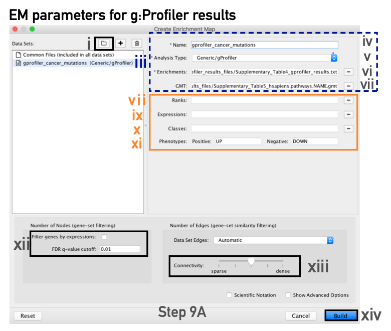
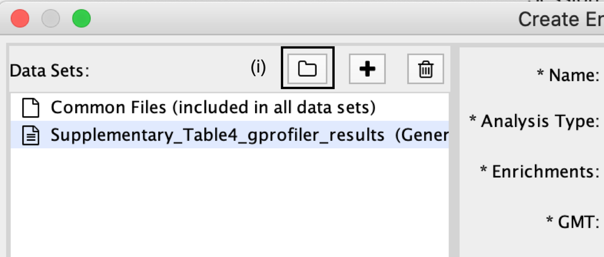
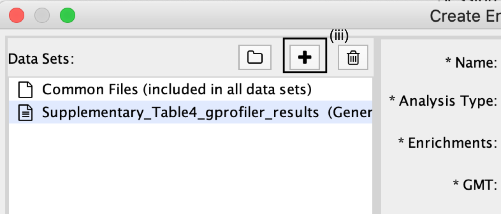
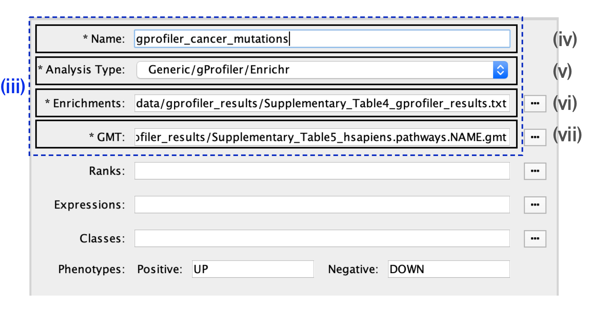
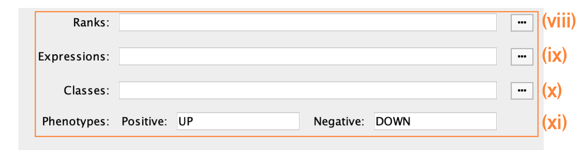
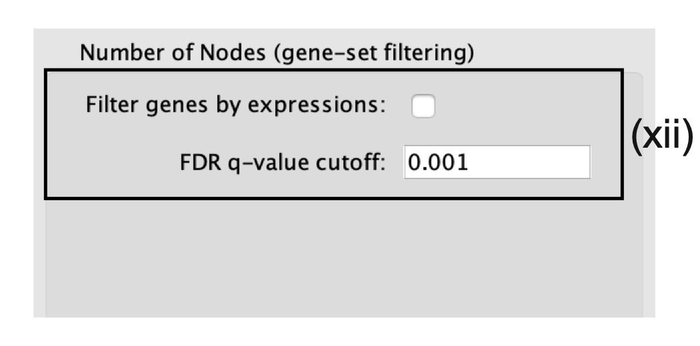
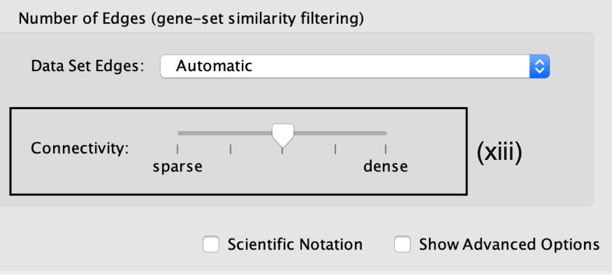
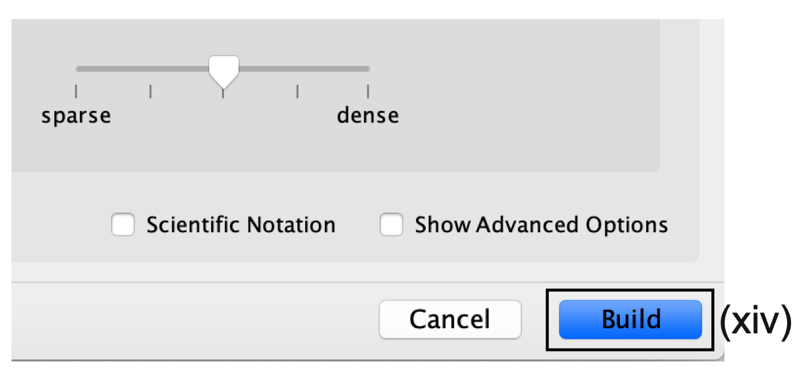
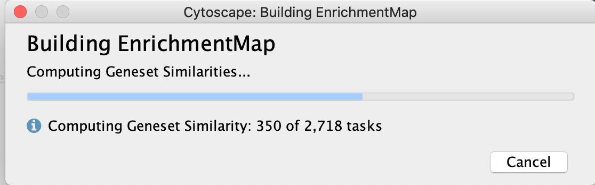
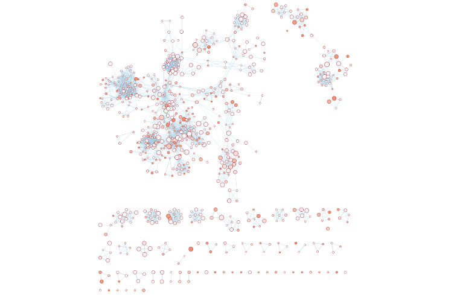

# (9A) g:Profiler - Creation of enrichment maps for results generated in Step 6A {#gprofiler-em}

**Step 9A** -

## Parameter specification

<p align="center">
  
 </p>
 
 i. In the *Create Enrichment Map* panel, click on folder icon.
 
<p align="center"> </p>

 <ol start=2 type="i">
<li> Locate and select your *result data folder* containing the g:Profiler results and click on *Open*.</li>
</ol>

```{block, type="rmd-troubleshooting"}
**Autoload of g:Profiler results creates many datasets with incorrect file specifications** 

  * There are too many text files within the directory specified.
  * To simplify loading g:Profiler results into EnrichmentMap and populating the correct fields in the EnrichmentMap interface, place the g:Profiler results file and gene set file (i.e., [Supplementary_Table4_gprofiler_results.txt](./data/Supplementary_Table4_gprofiler_results.txt) and [Supplementary_Table5_hsapiens.pathways.NAME.gmt](./data/Supplementary_Table5_hsapiens.pathways.NAME.gmt)) into a directory together by themselves.
  * See Example [here](./data/gprofiler_results/)
  
```

 <ol start=3 type="i">
<li> In the right-hand pane, g:Profiler output files will be automatically populated into their specified fields. Alternatively, users can click on the ‘+’ symbol to specify each of the required files manually.</li>
</ol>

<p align="center"> </p>

 <ol start=4 type="i">
<li> In the right-hand pane, modify the *Name* of the created dataset if desired. By default, EnrichmentMap will use the name of the g:Profiler enrichment results file (e.g., ‘Supplementary_Table4_gprofiler_results.txt’).</li>
<li>Verify that the *Analysis Type* is set to *Generic/gProfiler/Enrichr*.</li>
<li>Verify the Enrichments results file is the g:Profiler file downloaded in Step 6A(xi) (or alternatively, manually specify ‘Supplementary_Table4_gprofiler_results.txt’).</li>
<li>Verify the GMT specified is the file retrieved from the g:Profiler website in Step 6A(xii). Use the file ‘hsapiens.pathways.NAME.gmt’ (or alternatively manually specify ‘Supplementary_Table5_hsapiens.pathways.NAME.gmt’) that contains the gene sets corresponding to GO biological processes and Reactome pathways.</li>
</ol>

<p align="center"> </p>

## Specification of additional optional files:

<ol start=8 type="i">
<li> *Expressions*. (Optional) Upload an expression matrix for the genes analyzed in g:Profiler or, alternatively, upload an expression dataset of all genes. If the expression dataset contains additional genes not used for the g:Profiler search, their expression values will still appear in the heat map of the enrichment map (for an example file, see Supplementary Table 6).</li>
<li>*Ranks*. (Optional) Ranks for the gene list or the expression data can be specified (for an example, see Supplementary Table 2).</li>
<li>*Classes*. (Optional) This is a GSEA CLS file defining the phenotype (i.e., biological conditions) of each sample in the expression file; for an example, see Supplementary Table 7. This file is required only for phenotype randomization in GSEA; however, providing it to EnrichmentMap will label the columns of the expression file in the EnrichmentMap heat map viewer by phenotype.</li>
<li>*Phenotypes*. (Optional) If there are two different phenotypes in the expression data, update the phenotype labels so that ‘positive’ represents the phenotype associated with positive values (mesenchymal in this example) and ‘negative’ represents that associated with negative values (immunoreactive in this example).</li>
</ol>

<p align="center"> </p>

```{block, type="rmd-tip"}
**Using phenotypes with g:Profiler analyses**

Although an individual g:Profiler analysis has only one phenotype, it is possible to modify a single results file to contain two analyses. This is relevant when the phenotypes are mutually exclusive. For the analysis you want to associate with the additional phenotype (which would correspond to downregulated genes in GSEA PreRanked, thus called ‘negative’) 

  * open the g:Profiler results file (preferably in a spreadsheet, so you can easily modify a single column). 
  * The fifth column specifies the phenotype. Update the column to have the value of ‘−1’ for each result in the file. 
  * Open the second analysis file. Copy all the results from the second file and paste them into the updated negative g:Profiler file. 
  * Save the file and use it as the g:Profiler enrichment results file in the EnrichmentMap interface instead of the original results files. 
  
  Pathways corresponding to two phenotypes will be colored red and blue in the resulting enrichment map. **One limitation with this approach is that a pathway cannot be included in both the positive and the negative sets.**
```

## Tuning parameters

<ol start=12 type="i">
<li>*Number of Nodes*.</li>
</ol>

  * By default, g:Profiler returns only statistically significant results (Q < 0.05), so the FDR q-value cutoff parameter can be set to 1 in the EnrichmentMap Input panel, unless a more stringent filtering is desired. 
  * For this protocol, set the FDR Q value to **0.001**. 
  * (Optional) Select Filter genes by expressions to exclude any genes in the gene set definition file (i.e., the GMT file) that are not found in the supplied expression file. 
  * If Filter genes by expressions is not selected, any gene that is not found in the expression file will be retained and will be presented in the expression heat map viewer with all of its associated expression values grayed out.
  
<p align="center"> </p>
  
<ol start=13 type="i">
<li>*Number of Edges*.</li>
</ol>

  * Keep the connectivity slider in the center. 
  * If the network is too cluttered because of too many connections (edges), move the slider to the left to make the network sparser. 
  * Alternatively, if the network is too sparse (i.e., there are too many disconnected pathways), move the slider to the right to obtain a more densely connected network.

<p align="center"> </p>

```{block, type="rmd-tip"}
Moving the slider to the left (or right) will adjust the underlying similarity statistic threshold to make the resulting network sparser (or denser). 

  * The slider is set with predefined defaults, but users can fine-tune the similarity metric by selecting Show advanced options at the bottom of the Create Enrichment Map panel. 
  * Predefined values appear as tick marks on the slider and include:
    * Jaccard > 0.35, 
    * Jaccard > 0.25, 
    * combined > 0.375, 
    * overlap > 0.5, and 
    * overlap > 0.25.
```

<ol start=14 type="i">
<li>Click the *Build* button at the bottom of the EnrichmentMap Input panel. </li>
</ol>

<p align="center"> </p>

  * A Building EnrichmentMap box appears and indicates the progress status. This box will disappear once the map has been created successfully. 
  
  <p align="center"> </p>
  
  * the resulting enrichment maps from the g:Profiler analysis.
  
   <p align="center"> </p>