# (9B) GSEA - Creation of enrichment maps for results generated in Step 6B {#gsea-em}

**Step 9B** -

## Parameter specification

<p align="center">
  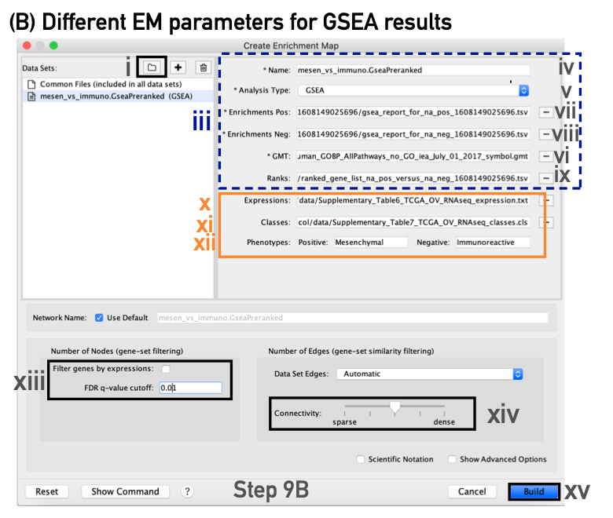
 </p>

i. In the *Create Enrichment Map* panel, click on folder icon and locate the GSEA results folder created in Step 6B .
 
<p align="center"> 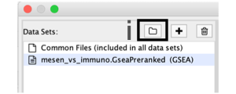</p>

 <ol start=2 type="i">
<li> Click on the GSEA folder to select it. Click on *Open*.</li>
</ol>

```{block, type="rmd-tip"}
If you specify a directory that contains multiple GSEA results, rather than an individual GSEA results folder, EnrichmentMap will treat each GSEA results folder as a separate dataset. This enables easy multi-dataset analyses. If you want only one dataset but inadvertently selected the directory containing multiple GSEA results instead of selecting an individual folder, simply select the datasets you do not want to use and click on the trash can at the top of the EnrichmentMap input panel to remove them.
```

```{block, type="rmd-tip"}
If you specify a directory for Enrichment to auto populate your files for you this will result in the following parameters being filled:

<p align="center"> 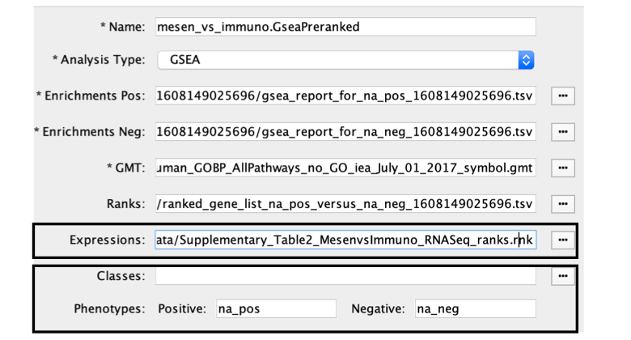</p>

When GSEA results are generated from preranked gene list there is no expression file associated with the GSEA results and EM will automatically put the ranked list as the expression file.  Make sure to update the it if you have an expression file associated with the analysis. The ranks will still be loaded as well through the RNK file parameter.
```

 <ol start=3 type="i">
<li> In the right-hand pane, GSEA output files will be automatically populated into their specified fields. Alternatively, users can click on the ‘+’ symbol to specify each of the required files manually.</li>
</ol>

<p align="center"> 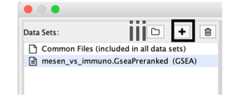</p>

 <ol start=4 type="i">
<li> In the right-hand pane, modify the *Name* of the created dataset if desired. By default, EnrichmentMap will use the first part of the GSEA folder name before the last dot (.) to create the dataset name. For example, if the directory is called Mesen_vs_Immuno.GseaPreranked.12345, the name will be populated as Mesen_vs_Immuno.GseaPreranked.</li>
<li>Verify that the *Analysis Type* is set to *GSEA*.</li>
<li>*Enrichments Pos*. Verify that the file name is set to ‘[your_path_to_gsea_dir]/Mesen_vs_Immuno.GseaPreranked.12345/gsea_report_for_na_pos_12345.xls’, where ‘12345’ is a unique number generated by GSEA. Alternatively navigate to the ‘Supplementary_Table8_gsea_report_for_na_pos.xls’ file.</li>
<li>*Enrichments Neg*. Verify that the file name is set to ‘[your_path_to_gsea_dir]/gsea_report_for_na_neg_12345.xls’, where ‘12345’ is a unique number generated by GSEA. Alternatively navigate to the file ‘Supplementary_Table9_gsea_report_for_na_neg.xls’.</li>
</ol>

```{block, type="rmd-troubleshooting"}
** A random number is appended to the GSEA directory name**

Each GSEA analysis generates a random number that is appended to the names of the files and directories. The number will be different for each new analysis
```

<ol start=8 type="i">
<li>*GMT*. Verify that the file name is set to ‘Supplementary_Table3_Human_GOBP_AllPathways_no_GO_iea_July_01_2017_symbol.gmt’. Alternatively, navigate to the file ‘Supplementary_Table3_Human_GOBP_AllPathways_no_GO_iea_July_01_2017_symbol.gmt’.</li>
</ol>

```{block, type="rmd-troubleshooting"}
**EnrichmentMap uses a GMT file that was not the original file input to GSEA**

  * The original GMT file was moved or no longer exists in the location in which GSEA saved it.
  * If EnrichmentMap cannot find the original GMT file used in the GSEA analysis, it will use a filtered GMT file found in the GSEA ‘edb’ results directory. EnrichmentMap will not be able to find your original GMT file if you have moved it since running GSEA analysis. Although it is a GMT file, it has been filtered to contain only genes found in the expression file. If you use this filtered file, you will obtain different pathway connectivity depending on the expression data being used. You should always use the original GMT file used for the GSEA analysis and not the filtered one in the results directory
```


<ol start=9 type="i">
<li>*Ranks*. Verify that the file name is set to ‘ranked_gene_list_na_pos_versus_na_neg_12345.xls’, where ‘12345’ is a unique number generated by GSEA. Alternatively, navigate to the ‘Supplementary_Table2_MesenvsImmuno_RNASeq_ranks.rnk’ file.</li>
</ol>

<p align="center"> 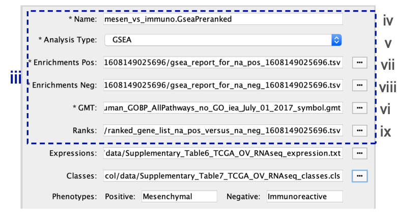</p>

## Specification of additional optional files:

<ol start=10 type="i">
<li> *Expressions*. (Optional) Upload an expression matrix for the genes analyzed in GSEA. For an example file, see ‘Supplementary_Table6_TCGA_OV_RNAseq_expression.txt’.</li>
<li>*Classes*. (Optional) This is a GSEA CLS file defining the phenotype (i.e., biological conditions) of each sample in the expression file; for an example, see Supplementary Table 7. This file is required only for phenotype randomization in GSEA; however, providing it to EnrichmentMap will label the columns of the expression file in the EnrichmentMap heat map viewer by phenotype.</li>
<li>*Phenotypes*. (Optional) In the text boxes replace, ‘na_pos’ with ‘Mesenchymal’ and ‘na_neg’ with ‘Immunoreactive’. ‘Mesenchymal’ will be associated with red nodes because it corresponds to the positive phenotype, whereas ‘Immunoreactive’ phenotypes will be labeled blue.</li>
</ol>

<p align="center"> 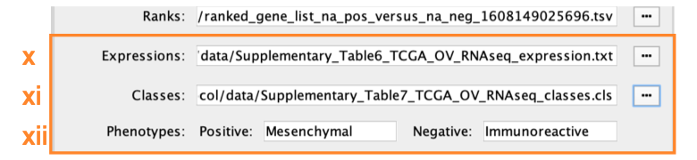</p>

```{block, type="rmd-tip"}
If you load the CLS file before specifying the phenotypes, EnrichmentMap will automatically guess the phenotypes from the class file. If your class file specifies more than two phenotypes, EnrichmentMap will choose the first two phenotypes defined in the file. To annotate the phenotypes in the EnrichmentMap heat map, the specified phenotype labels need to exactly match the GSEA CLS file.
```

## Tuning parameters

<ol start=13 type="i">
<li>*Number of Nodes*.</li>
</ol>
  * Set the FDR Q value cutoff to 0.01.
  * (Optional) Select Filter genes by expressions to exclude any genes in the gene set definition file (i.e., the GMT file) that are not found in the supplied expression file. 
  * If Filter genes by expressions is not selected, any gene that is not found in the expression file will be retained and will be presented in the expression viewer with all of its associated expression values grayed out.

<p align="center"> 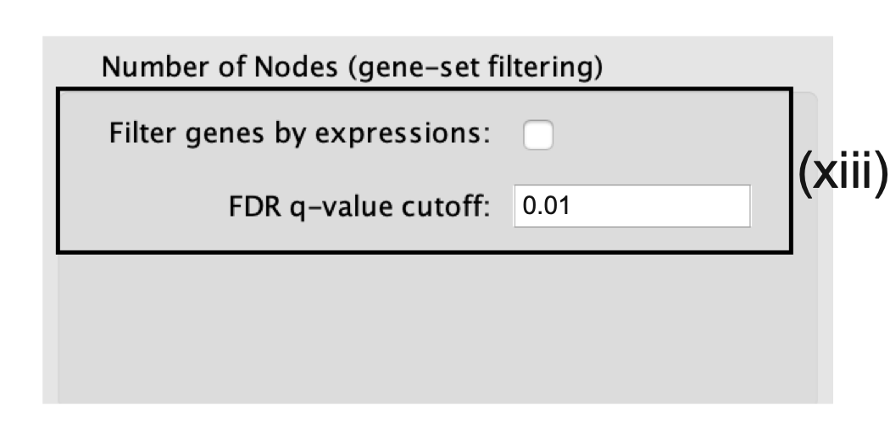</p>

```{block, type="rmd-troubleshooting"}
**User cannot provide a sufficiently precise Q value**

To set the threshold to a small number, select Scientific Notation and set a Q value cutoff such as 1E−04
```

<ol start=14 type="i">
<li>*Number of Edges*.</li>
</ol>

  * Keep the connectivity slider in the center. 
  * To create networks with fewer edges,(a sparser network), move the slider to the left. 
  * Alternatively, to create networks with more edges (a denser network), move the slider to the right.

<p align="center"> 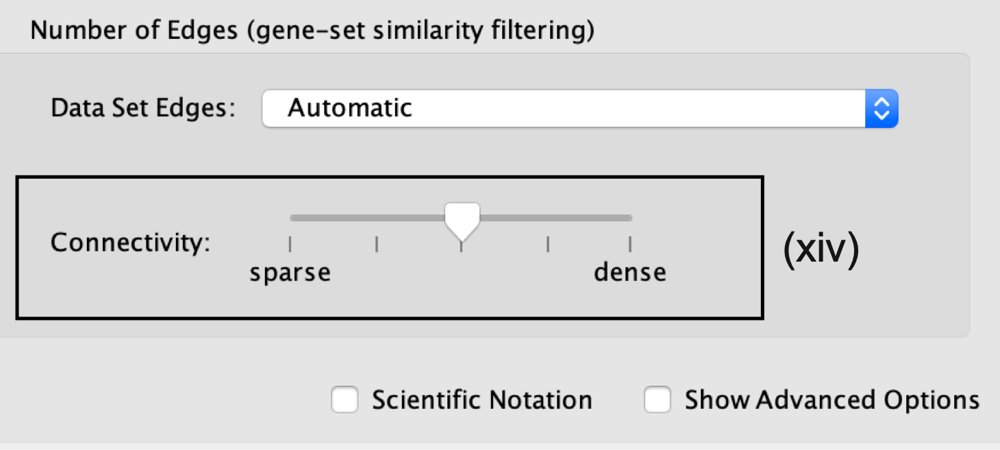</p>

```{block, type="rmd-tip"}
Moving the slider to the left (or right) will adjust the underlying similarity statistic threshold to make the resulting network sparser (or denser). 

  * The slider is set with predefined defaults, but users can fine-tune the similarity metric by selecting Show advanced options at the bottom of the Create Enrichment Map panel. 
  * Predefined values appear as tick marks on the slider and include:
    * Jaccard > 0.35, 
    * Jaccard > 0.25, 
    * combined > 0.375, 
    * overlap > 0.5, and 
    * overlap > 0.25.
```

<ol start=15 type="i">
<li>Click the *Build* button at the bottom of the EnrichmentMap Input panel. </li>
</ol>

<p align="center"> 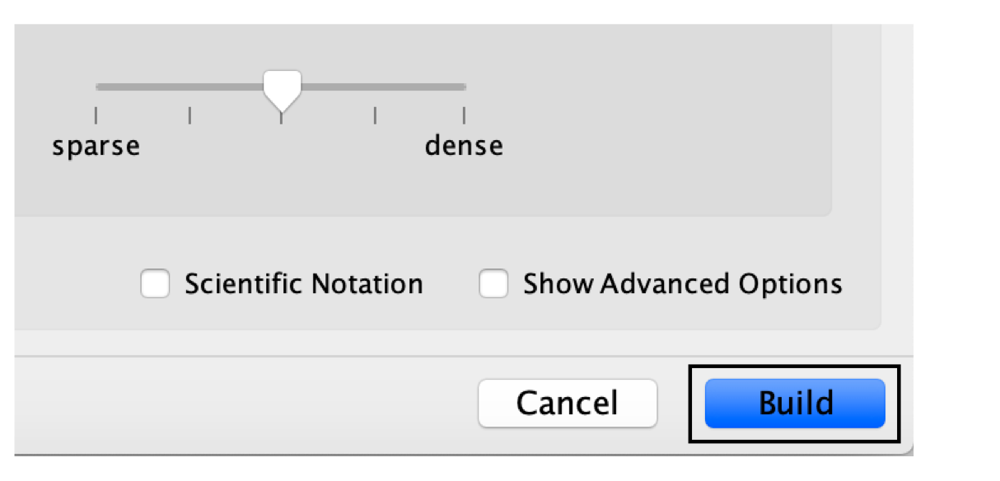</p>

  * A Building EnrichmentMap box appears and indicates the progress status. This box will disappear once the map has been created successfully. 
  
  <p align="center"> 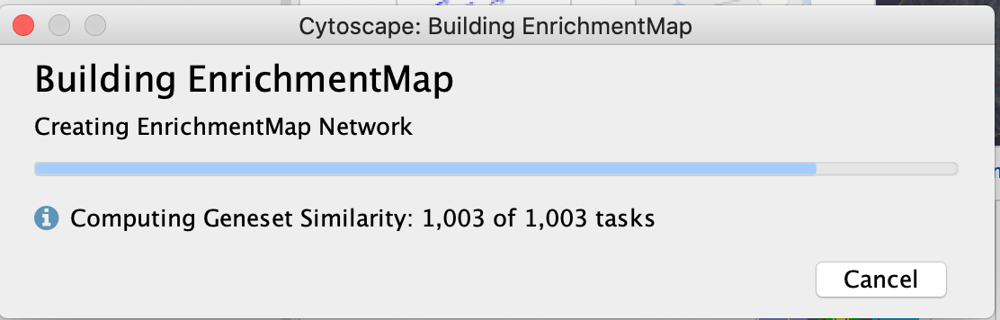</p>

  * the resulting enrichment maps from the GSEA analysis.
  
   <p align="center"> 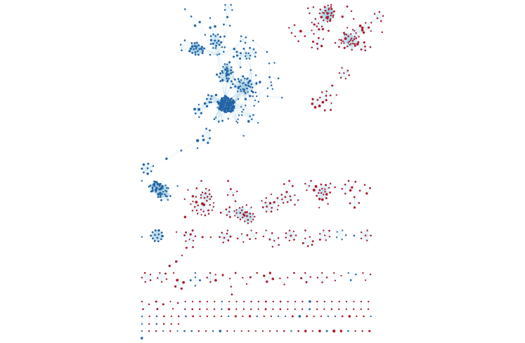</p>