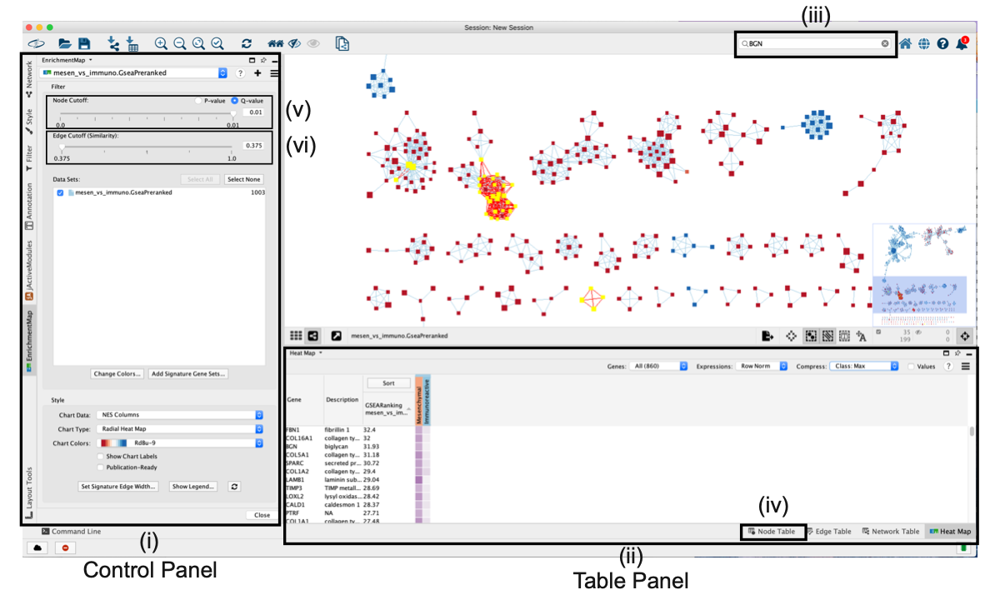
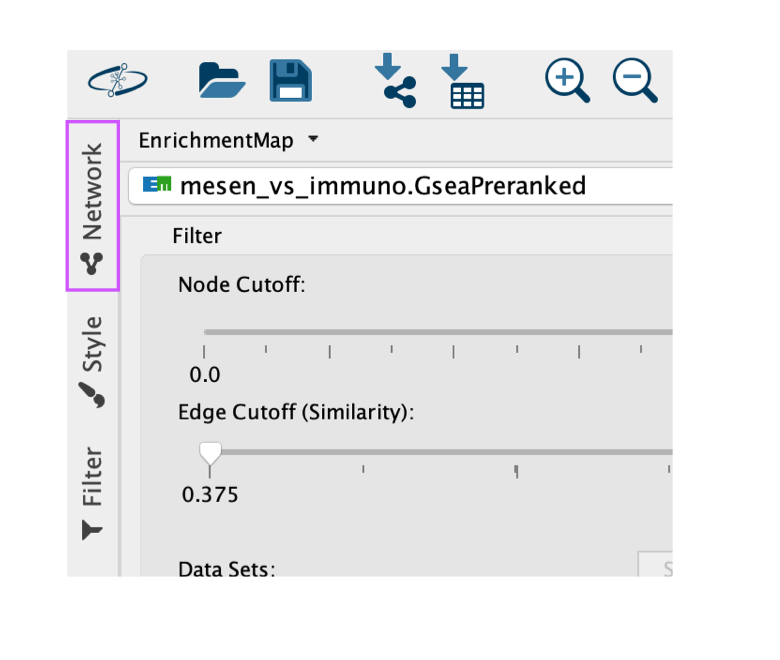
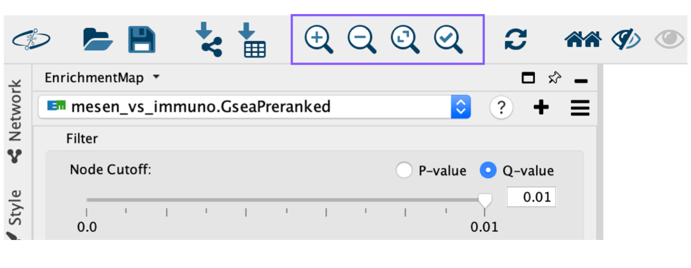
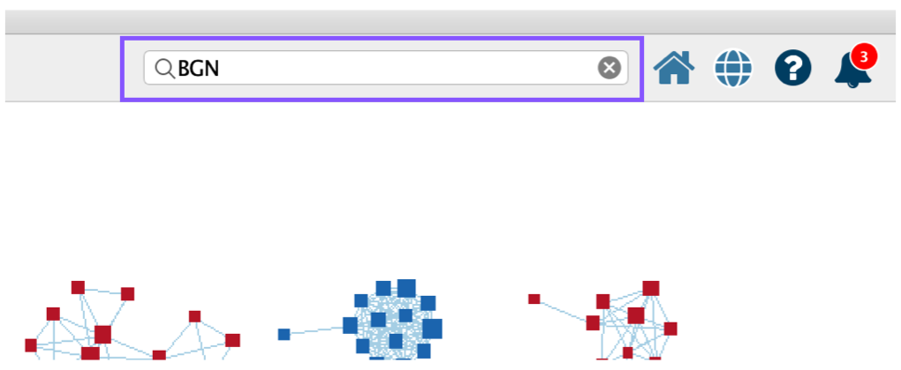
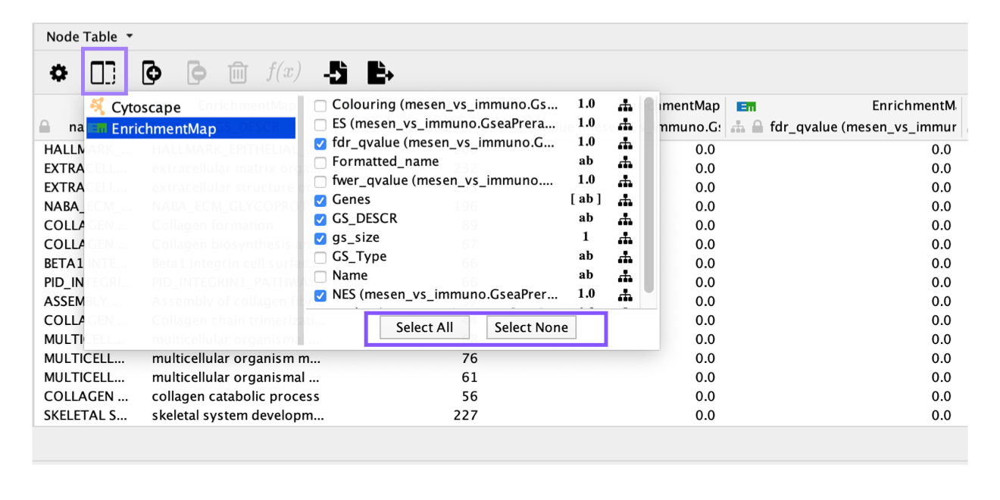
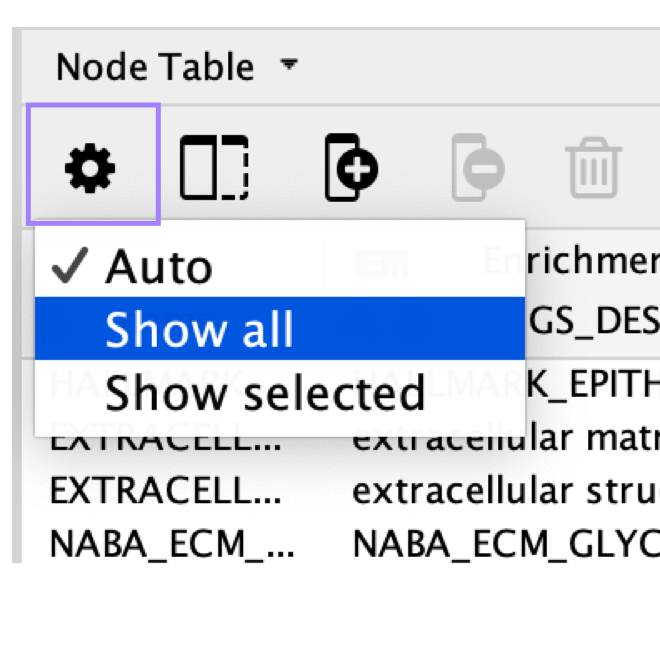

# (10-12) Navigation and interpretation of the enrichment map

An enrichment map must be interpreted to discover novel information about a dataset and must be manually refined to create a publication-quality figure.

10. To explore the enrichment map, select the network of interest in the *Control Panel* located at the left side of the Cytoscape window. 

<p align="center"> </p>

  i. Cytoscape ‘Control Panel’, which contains ‘Networks’, ‘Styles’ and ‘Select’ tabs as well as the ‘EnrichmentMap’ main panel.
  i. The ‘Table Panel’ contains tables with node, edge and network attributes, as well as an enrichment map ‘Heat Map’ panel displaying expression for genes associated with selected nodes and edges. 
  i. Cytoscape search bar, which can be used to search for genes in the enrichment map. 
  i. ‘Node Table’ containing values for all variables associated with each node in the network. 
  i. Q-value or P-value slider bar. By default, the slider is set to Q value if the data contains Q values but can be changed to use P values by selecting the ‘P-value’ radio button. All nodes that pass the initial Q-value threshold are displayed in the enrichment map. By moving the slider to the left, the Q-value threshold is adjusted to a lower value, removing any nodes that do not pass the Q-value threshold. The currently set threshold will be displayed in the accompanying text box. Thresholds can be manually adjusted by modifying the text box value directly. 
  i. ‘Edge Cutoff (Similarity)’ slider bar. The slider bar modifies the similarity threshold. The similarity threshold can only be increased; i.e., edges are required to have more genes in common in order to remain visible, which will remove edges from the network that do not satisfy the threshold. One can also manually change the threshold by modifying the text box value directly.
  
  * The Network Panel can be selected using the top most tab of the Control Panel. 
    * <p align="center"> </p>
  * The selected network will appear in the main window; navigate to it (zoom and pan) using Cytoscape controls, and 
    * <p align="center"> </p>
  * explore the pathways by reading the gene set labels. Pathways with many common genes often represent similar biological processes and are grouped together as sub-networks or themes in the network. Click on a node to display the corresponding genes in the table below the network view.
  
```{block, type="rmd-troubleshooting"}
**Few or no pathways are present in EnrichmentMap**

A pathway enrichment analysis resulting in few or no enriched pathways may be caused by suboptimal statistical processing used to define the original gene list. Enriched pathways are unlikely to be found if the gene list ranks are too noisy and the most important genes are not at the top of the list, no genes are highly significant, or a large fraction of genes are highly significant. If the gene list has been correctly defined, analyzing further databases of pathways and gene sets or setting more liberal filters may improve results
```

11. To find a gene or pathway of interest, type its name in the search bar located in the top right corner. All pathways containing that gene will be highlighted. For example, TP53 and BGN are the top genes in g:Profiler and GSEA analyses, respectively.
    * <p align="center"> </p>

```{block, type="rmd-troubleshooting"}
**User cannot find any pathways with search gene**

Multiple genes separated by spaces can be entered into the search bar. Any pathway that contains the gene will be selected and highlighted in the network. Adding keywords with ‘AND’ into the search bar will show only pathways that contain all genes in the search query (e.g., ‘geneA AND geneB’). If the original analysis did not use gene symbols, then you will not be able to search by gene symbols. Instead, use the identifier type that the analysis was based on, for example Entrez Gene ID or Ensembl gene ID
```

    
12. To find the most enriched pathways:
  * look at the Table Panel located below the network view. 
  * Select the Node Table tab , and 
  * Select and sort the column named ‘EM#_fdr_qvalue’ (for g:Profiler) or ‘EM#_NES’ (for GSEA) by clicking on the column header.
  * To highlight a subset of these pathways in the network, select rows corresponding to the pathways of interest, right-click on any selected row in the table and select *Select nodes from selected rows*.

```{block, type="rmd-tip"}
You can reduce the number of columns displayed in the Node table by changing the selected columns by clicking on the column icon in the Table viewer.

  * By default all the enrichment map columns are selected.

  * <p align="center"> </p>

```

```{block, type="rmd-troubleshooting"}
**There are very few entries in the node table, although the network contains many nodes**

If there are very few records in the node table, make sure that no nodes are selected in the network. Or click on the gear icon and change the setting from Auto to Show all

  * <p align="center"> </p>
```

13. Depending on the focus of the analysis, there are different actions that can be taken on the resulting enrichment map. 
  * Follow option A to explore the Table Panel heat map; 
  * option B to organize and clarify the network; 
  * option C to define major biological themes; 
  * option D to create a simplified network view; 
  * option E to manually arrange the network nodes; and 
  * option F to create a subnetwork that highlights a specific theme subset.   * Skip ahead to Step 14 to save the image and to generate legends.
  

  