# (13A) Exploring the Table Panel heat map

## Expression Viewer
  i.When a gene expression matrix is provided as input to EnrichmentMap, we can study the expression pattern of the genes included in enriched pathways. 
  * Click on either an individual node -  
<p align="center"> 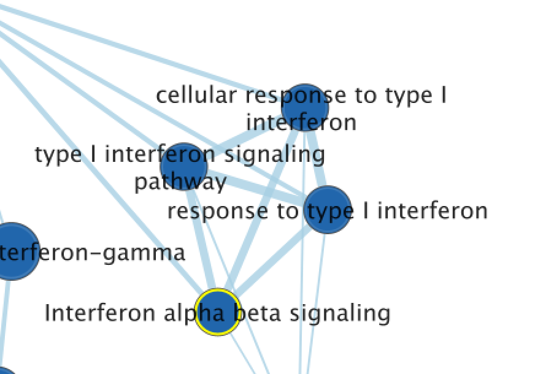</p>
  * or a group of nodes - 
<p align="center"> 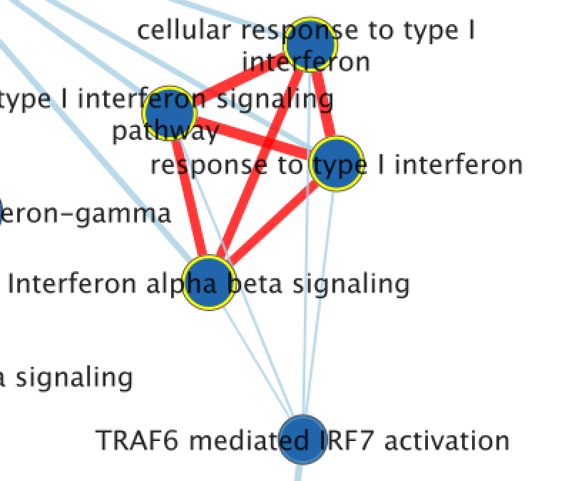</p>
  to generate a gene expression heat map that will appear in the *Heat Map* tab of the *Table Panel*.
  * If the analysis is based on GSEA results and a rank file is supplied, the ‘leading edge’ genes will be highlighted in yellow for **individual** node selections.
<p align="center"> 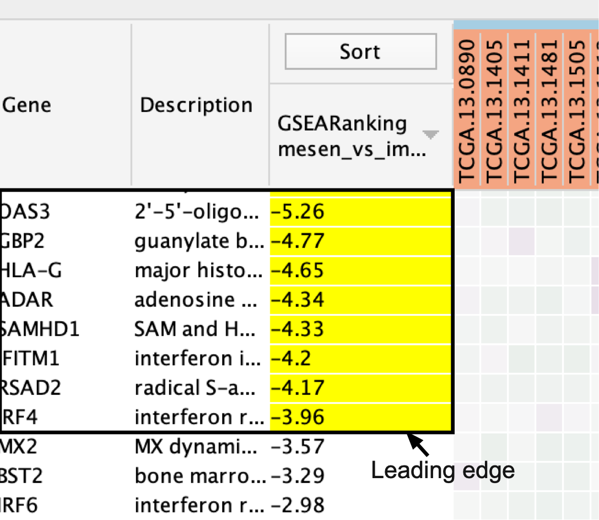</p>
  * Several options for heat map visualization are available.
  
```{block, type="rmd-tip"}
If no expression file is provided to EnrichmentMap as input, it will automatically create a dummy expression file in which any gene found in the enrichment file will be given a placeholder expression value of 0.25, and any gene found in a pathway but not found in the enrichment results file will be assigned a placeholder expression value of ‘NA’ (not applicable). Therefore, clicking on any node in the enrichment map will show the genes used for the analysis as well as genes in the pathway that are not part of the query set.
```

## Sorting options

<ol start=2 type="i">
<li>Adjust the *Sort* option.</li>
</ol>

  * Sorting options include:
    * hierarchical clustering, 
    * ranks or 
    * clicking on any of the column headers in heatmap will sort by that column 
  * To change the sorting option:
   * click on the *Sort* button visible in the top left corner of the heat map table. 
   * <p align="center"> 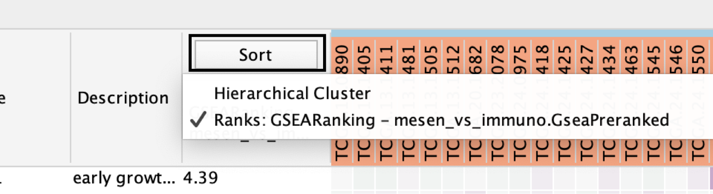</p>
   * By default, the heat map is sorted by ranks if a rank file is supplied.
   * In the absence of a rank file, no sort is applied. 
   * Additional rank files can be uploaded for comparison through the Settings menu located at the top right corner in the Heat Map panel.
     * <p align="center"> 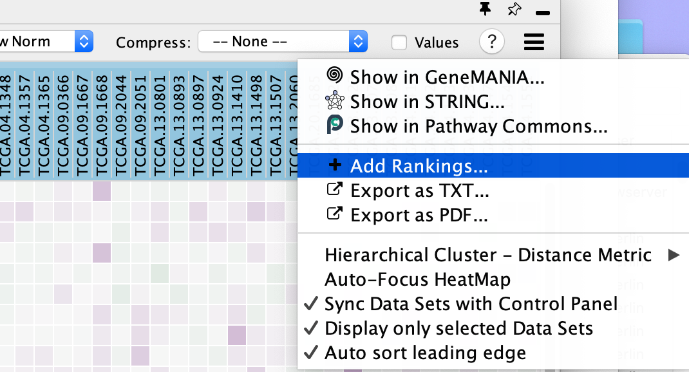</p>
   * Choosing which rank file to sort from can be done by clicking on the Sort button and selecting the rank file by name. 
   * Click the arrow next to the currently sorted column to invert the sort order. 
      * <p align="center"> 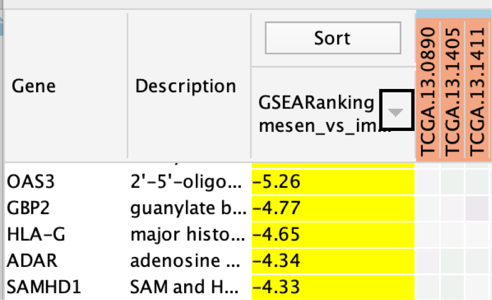</p>
   * Click any of the column names to sort the selected column.
   
```{block, type="rmd-troubleshooting"}
**User does not know which sort option to choose**

In the case of multiple conditions or conditions with variable expression profiles (e.g., cancer patient samples), hierarchical clustering tends to generate a more informative visualization
```

## Gene Options

<ol start=3 type="i">
<li>Define *Genes* you wish to visualize in the heat map</li>
</ol>

  * Data can be viewed for all genes contained in the selected nodes (union of nodes) or 
  * just for the genes common to selected nodes (intersection of nodes). By default, 
  * all genes are shown.
    * <p align="center"> 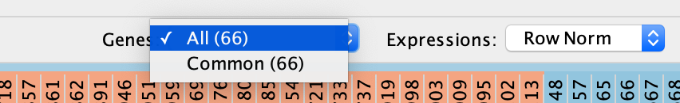</p>

## Expression data transformations    
<ol start=4 type="i">
<li>Change the *Expressions* value visualization depending on your data type</li>
</ol> 

  * Data can be viewed:
    * as they were loaded (Values), 
    * as row-normalized, in which case the row mean is subtracted from each value and then divided by the row’s standard deviation (Row Norm), 
    * or as log-transformed (Log).
    * By default, set to (Values).
        * <p align="center"> 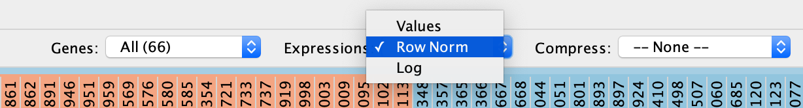</p>

<ol start=5 type="i">
<li>*Compress* heat map columns</li>
</ol>

  * By default, all expression values are visible as individual columns in the heat map for expression sets with <50 samples. 
  * It is possible to compress the data into a single column by selecting one of the aggregation methods:
    * Dataset - Median, 
    * Dataset - Max (maximum) or 
    * Dataset - Min (minimum)
    —listed under Compress. 
  * If a CLS file has been uploaded, the expression set can be compressed using one column per defined sample group using the Class option. 
    * Class - Median, 
    * Class - Max (maximum) or 
    * Class - Min (minimum)
    * Dataset - Median, 
    * Dataset - Max (maximum) or 
    * Dataset - Min (minimum)
  * If the expression matrix contains ≥50 samples, EnrichmentMap will automatically compress the values to their *Dataset median* value by default.
  
  * <p align="center"> 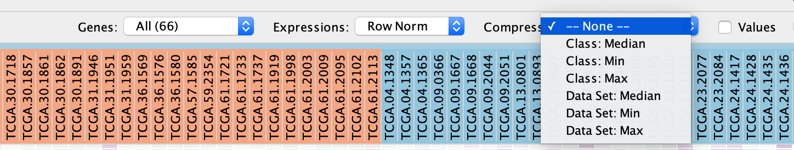</p>
  
<ol start=6 type="i">
<li>Check *Values* to show the expression numerical values in addition to the heat map color scale.</li>
</ol>  
  * <p align="center"> 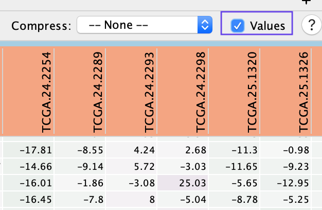</p>

## Additional Functions  
<ol start=7 type="i">
<li>Perform additional fine-tuning of the heat map using the *Settings* panel, accessed by clicking on the menu icon</li>
</ol>    

  * <p align="center"> 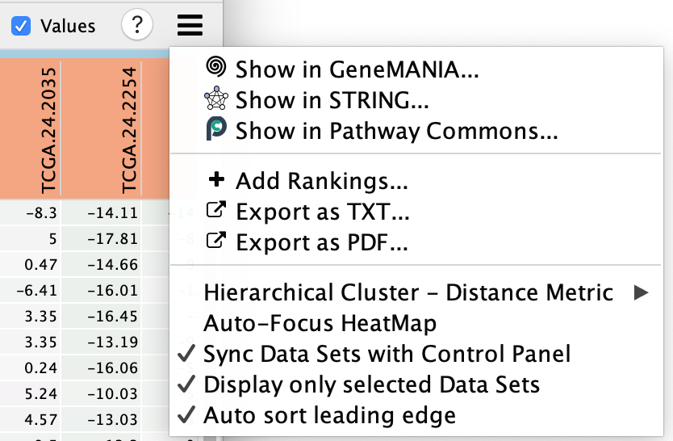</p>
  * This includes functionality to:
    * [Show in GeneMANIA...](#genemania) - Use the genes in the heatmap and search GeneMANIA[@genemania].
    * Show in STRING ... - Use the genes in the heatmap and search STRING.
    * Show in Pathway Commons... - Use the genes in the heatmap and search Pathway Commons.
    * Add Rankings - add new ranking files, 
    * Export as TXT... - export the heat map data as a tab-delimited text file
    * Export as PDF... - export the heat map data as a PDF image, 
    * change the distance metric for hierarchical clustering, 
    * Auto-focus HeatMap - turn on the node table heat map auto focus. 
    * Sync Data Sets with Control Panel
    * Display only selected Data Sets - when using multiple datasets there can be many expression files.  By default the heat map will only show the expression files of the selected dataset but if you would like to see them all then you can change this setting. 
    * Auto Select leading edge

<p align="center"> 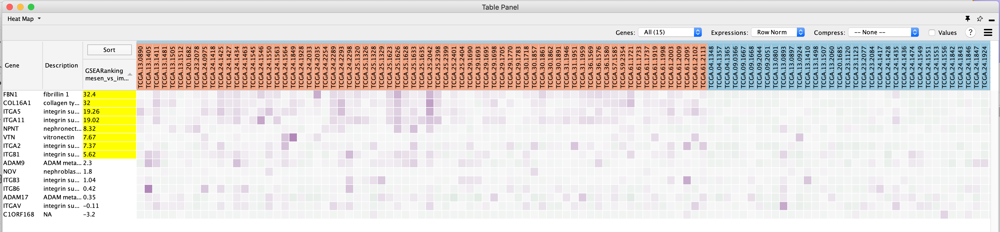</p>
Genes are sorted using the GSEA rank file, highlighting the leading edge in yellow. All genes contained in selected nodes are shown, expression values are row-normalized, no compression is applied and individual expression numerical values are not shown. Column headings are colored according to sample phenotype. Red color refers to the first phenotype (mesenchymal), and blue to the second phenotype (immunoreactive).

```{block, type="rmd-troubleshooting"}
**Heat map column names are not colored by dataset**

If the heat map columns are not colored for a GSEA analysis, make sure the phenotype names specified in the EnrichmentMap input panel match the class names specified in the class file (MesenchymalvsImmunoreactive_RNA-Seq_classes.cls). 
```

## Export Results

<ol start=8 type="i">
<li>The heat map can be exported to a text file for further analysis: click on the Settings icon of the heat map and select Export as TXT.</li>
</ol> 

<p align="center"> 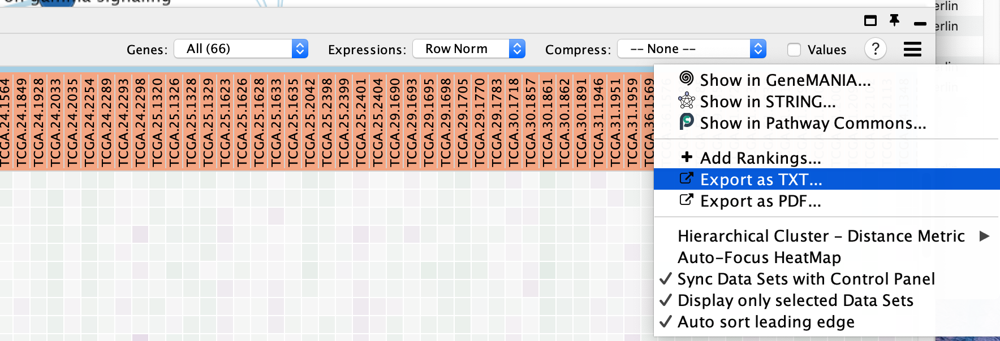</p>

<ol start=9 type="i">
<li>If only an individual node is selected, a dialog will offer to export the Leading edge only for GSEA analysis. If selected, only the highlighted genes will be exported; otherwise, the entire set of genes is saved.</li>
</ol> 

<p align="center"> 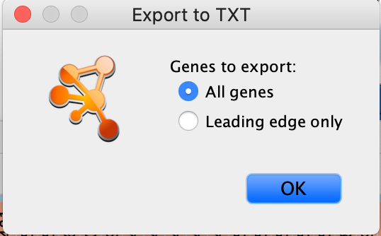</p>


```{block, type="rmd-troubleshooting"}
**The option to save only leading-edge genes is not available**

* Selection includes more than one node or dataset contains no leading-edge information (i.e., was not built from GSEA results 
* The leading edge is available only for GSEA analyses. The option will appear only if the enrichment map was built with GSEA results and a rank file was specified
```

<ol start=10 type="i">
<li>Specify the file name and location and click *Save*.</li>
</ol> 