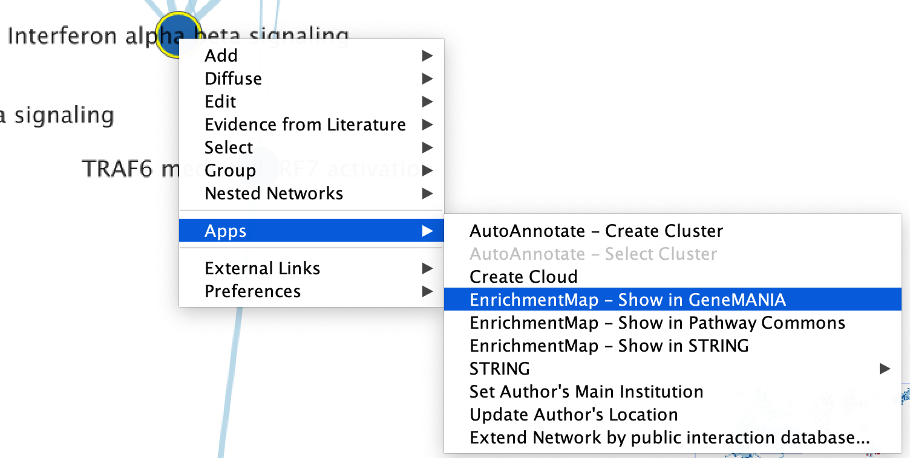
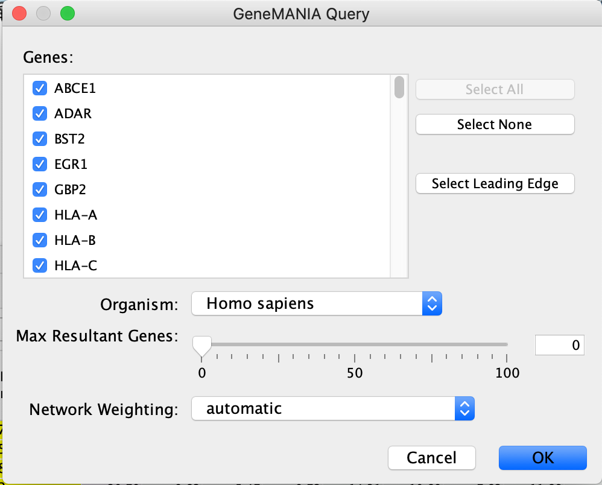
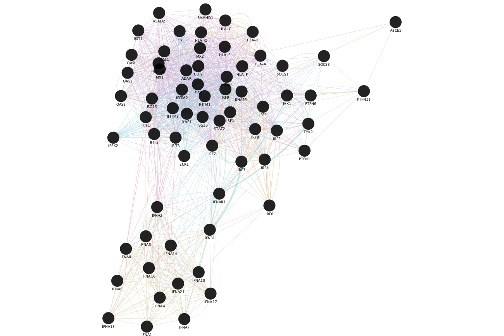
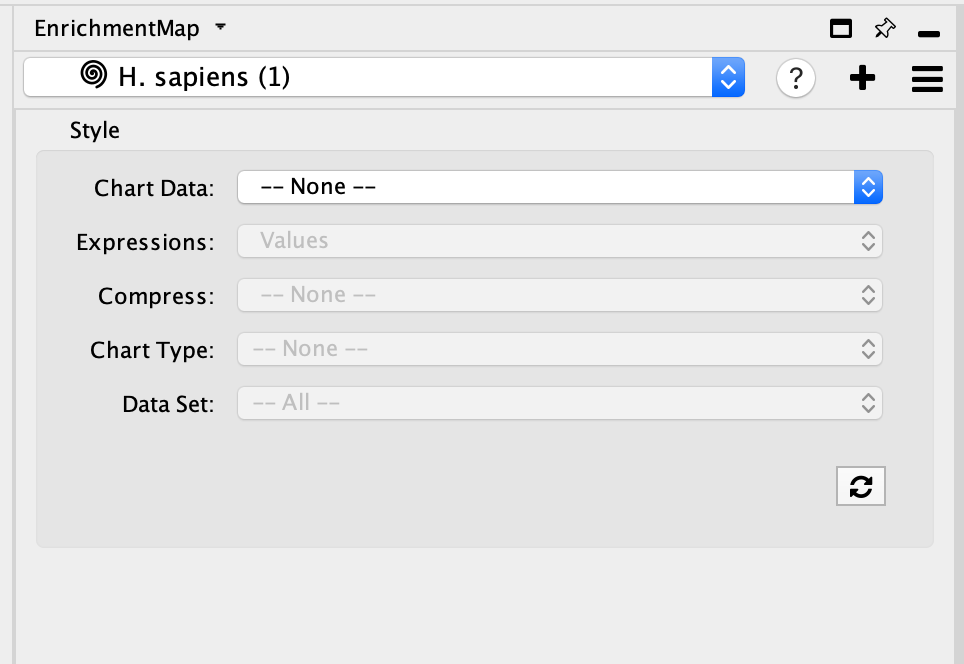
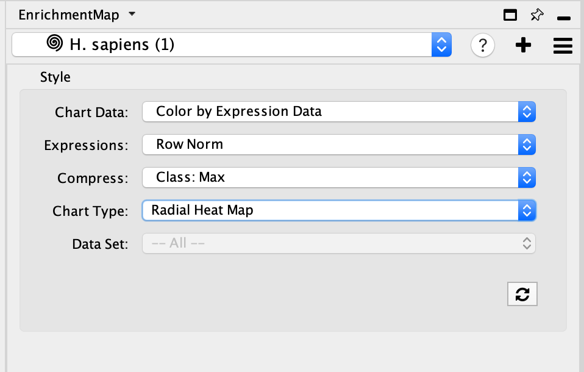
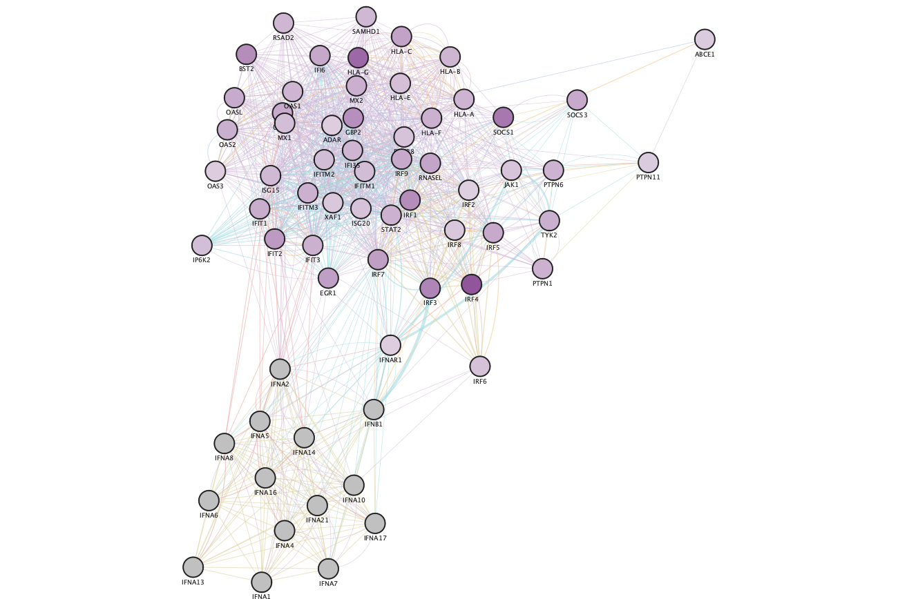
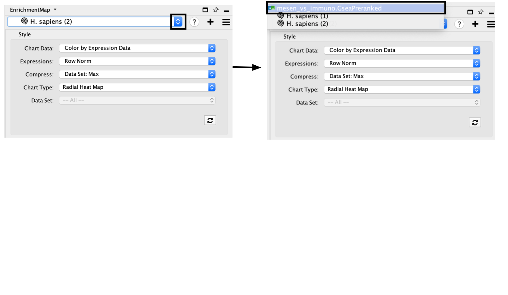
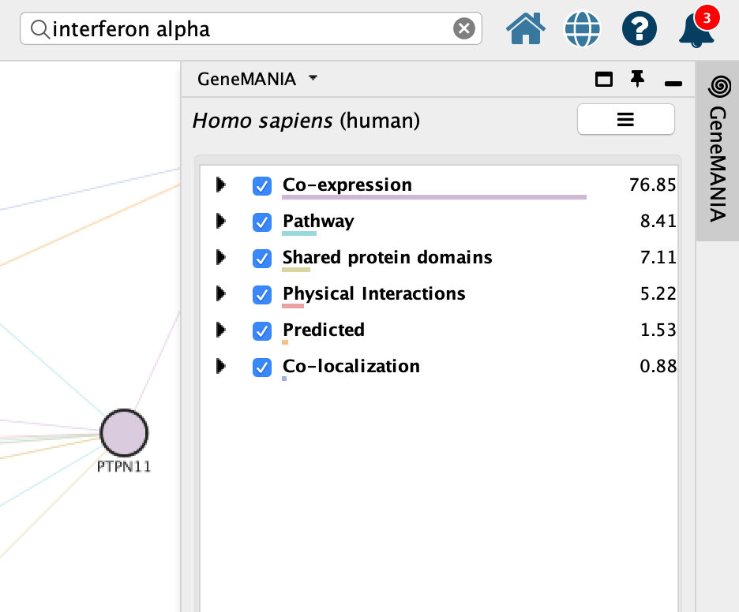
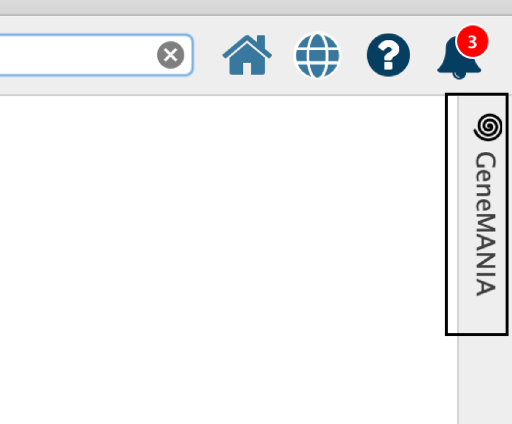
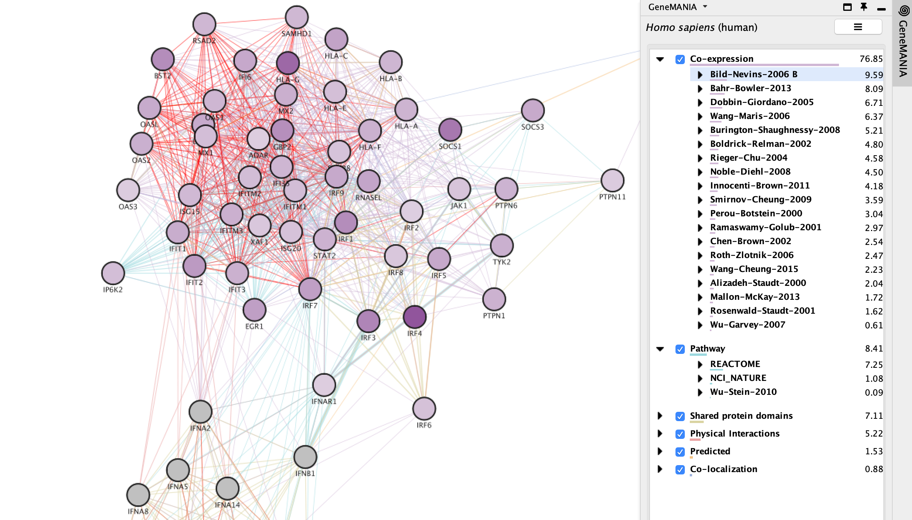

# Search GeneMANIA {#genemania}

  This function allows users to search GeneMANIA[@genemania] with a set of genes.  The genes are pulled from the selected nodes in the Enrichment map but can be adjusted by the user before initiating the query.

## Show connections between genes in Gene set using GeneMANIA

  * The *show in GeneMANIA* function can be accessed from the HeatMap settings menu as well as the *Right click* context menu in the network.  
<p align="center"> </p>
   * Right click on selected node/nodes.
   * Select *Apps* --> *EnrichmentMap - Show in GeneMANIA*
   * A *GeneMANIA Query* panel will show up for the user to adjust query parameters.
<p align="center"> </p>
  * Genes - The genes are pulled from all the selected nodes.  You can choose to change the selection to a subset of genes in the set by unclicking specific genes.  
  * If available, clicking on "Select leading edge" will limit the gene selection to just genes in the leading edge for the selected gene set.  Option will only be available for GSEA results where only a single gene set is selected.
  * *Organism* - select organism genes are associated with.
  * *Max Resultant genes* - the GeneMANIA algorithm looks for similar genes to the query set.  To see the connections of just the query genes set the *max resultant genes* to zero (default).  By increasing this threshold GeneMANIA will add similar genes to the resulting network.
  * *Network Weighting* - GeneMANIA is a network weighting algorithm where by it weighs it available networks such that it maximizes the connections between the query set of genes.  
  
<p align="center"> </p>  
Resulting GeneMANIA network using the genes from the selected node "Interferon alpha beta signaling".

## Update GeneMANIA visual style
  * You can change the visual properties of GeneMANIA network through the panel created by Enrichment map.
<p align="center"> </p> 
  * By default, the GeneMANIA network has the default GeneMANIA style.
  * Adjust style with Enrichment Map expression data using the panel.  The panel contains the similar features that are available in the Enrichment Map heatmap panel.
    * Chart Data - choose to colour by dataset or by expression data.
    * Expressions - if chart data is set to 'Color by Expression Data' choose from Values, Row Norm or log values.
    * Compress - if chart data is set to 'Color by Expression Data' choose from Class: Median, Class: Min, Class: Max, Dataset: Median, Dataset:Min, Dataset: Max, or None
    * Chart type - if chart data is set to 'Color by Expression Data' choose from Radial HeatMap or Heatstrips.
    * Data Set - if there are multiple datasets choose which dataset to colour by. 
<p align="center"> </p> 

<p align="center"> </p>  
Resulting GeneMANIA network using the genes from the selected node "Interferon alpha beta signaling" after colouring the GeneMANIA network with expression data from Enrichment Map.
    
```{block, type="rmd-tip"}
If you want to return to your Enrichment map
  * click on the drop down in the top of the Control panel and 
  * By default, the GeneMANIA network will be named by the species you are searching in.  For example, if you are searching in Homo Sapiens the network will be called H. Sapiens (1).  For each new search in the same species the number in parenthesis will be increased. 
  * jump back to the original enrichment map by selecting it from the drop down list.(For our example, click on mesen_vs_immuno.GSEAPreRanked to go to the original network.) 

<p align="center"> </p> 
```

## Explore GeneMANIA network

GeneMANIA[@genemania] returns the inter-connected network of query genes connected using various types of networks including:
  * Co-expression
  * Pathways
  * Shared protein domains
  * Physical interactions
  * Predicted
  * Co-localizations
You can see the weights associated with your query genes in the Cytoscape results panels located on the right hand side. 

<p align="center"> </p> 

```{block, type="rmd-tip"}
If the panel is not there, click on the GeneMANIA icon on the left hand bar to open it. 

<p align="center"> </p> 

```

Each network type contains hundreds of different networks and each network is associated with its own weight that contributes to the weight of the group.
  * You can expand each network type to see the individual networks. 
  * Clicking on an individual network or network type will highlight all the nodes and edges that are associated with it. 
  
  <p align="center"> </p> 