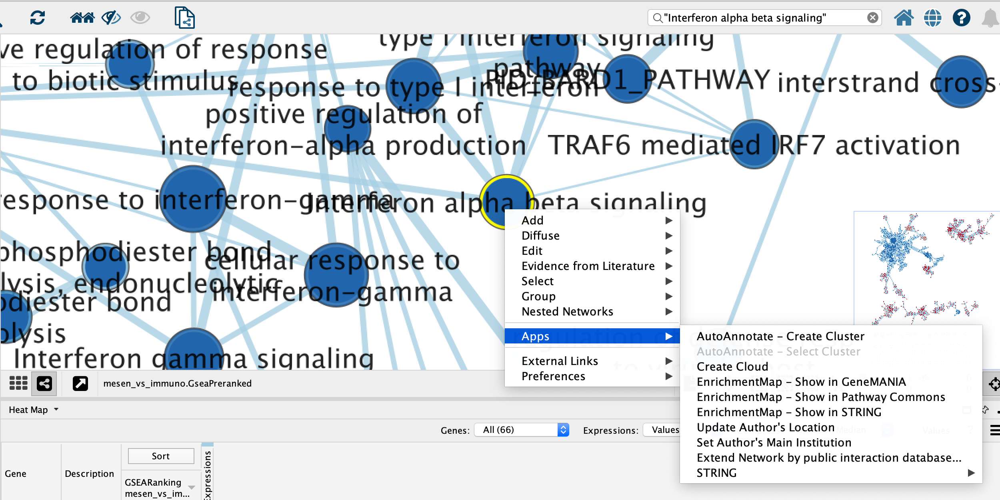
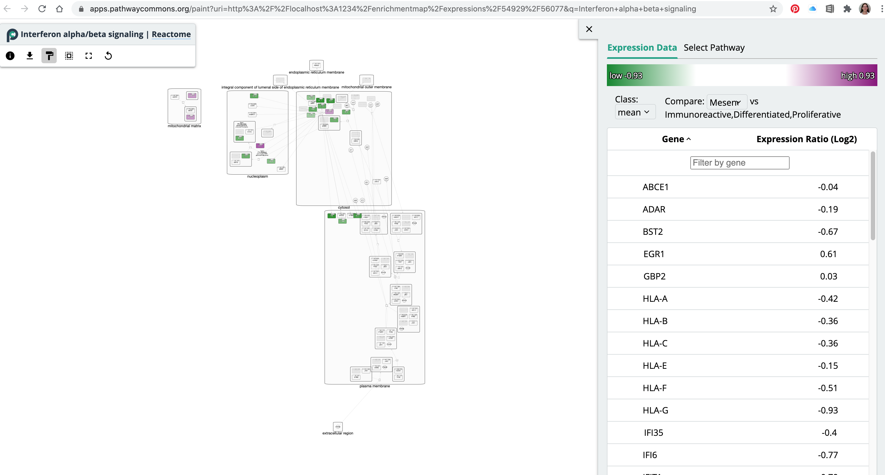
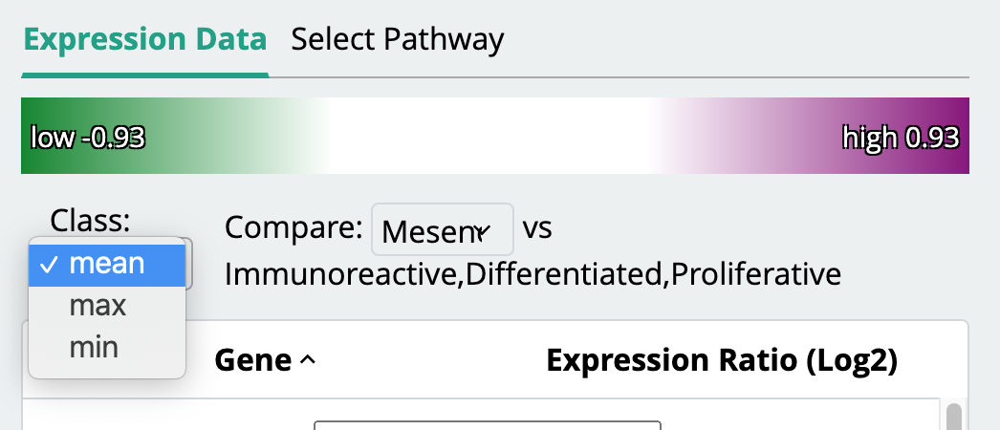
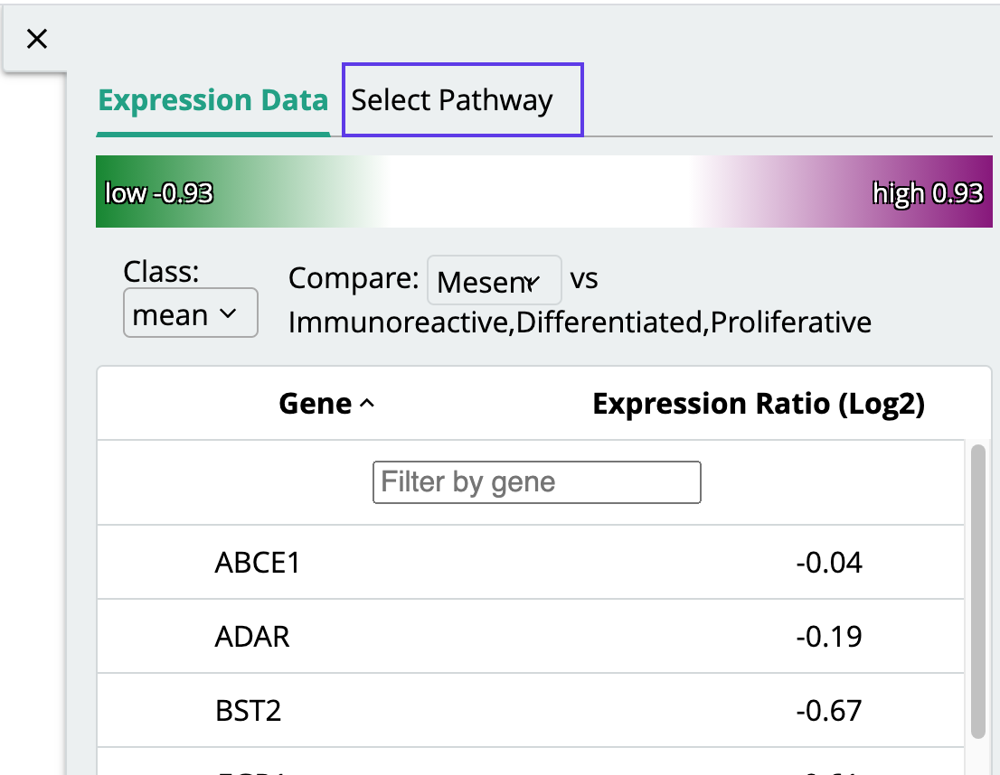
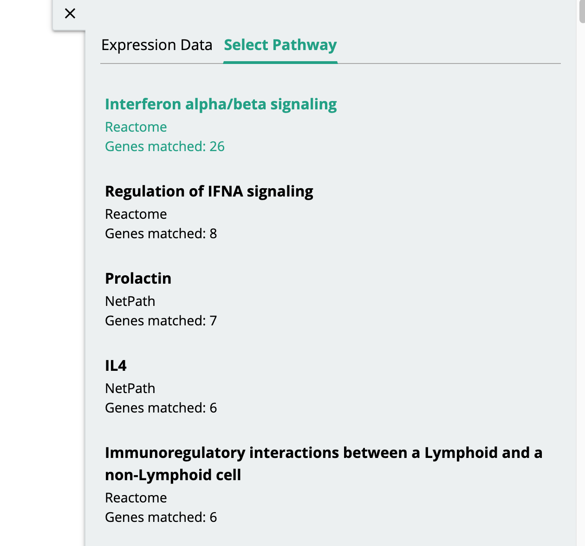

# Search Pathway commons {#pathwaycommons}

  This function allows users to search Pathway Commons[@pathwaycommons] with a set of genes.  The genes are pulled from the selected nodes in the Enrichment map but can be adjusted by the user before initiating the query.

  
```{block, type="rmd-troubleshooting"}

Pathway commons integration needs expression data to work properly.  If you have created an enrichment map without an expression set no network will be created in pathway commons.

```

## Show pathway connections between genes in Gene set using Pathway commons

 * The *show in Pathway Commons* function can be accessed from the HeatMap settings menu as well as the *Right click* context menu in the network.  
<p align="center"> </p>
   * Right click on selected node/nodes.
   * Select *Apps* --> *EnrichmentMap - Show in Pathway Commons*
   * Pathway commons will automatically launch in your web browser showing you the pathway that best matches your query.
<p align="center"> </p>

  * Genes in the pathway diagram that are coloured indicate the gene was found in the enrichment map. The colour indicates the degree of differential expression.
  
  * You can change the value of differential expression by adjusting the collapsing method in the right hand legend panel.
  
  <p align="center"> </p>
  
Pathway commons will attempt to find the best pathway that matches the set of genes that are passed to it.  Not all pathways are represented in pathway commons (and some are not based on formal pathway definitions, for example biological process from the gene ontology).  If the pathway chosen is not the best representation of the set of genes you queried you can manually choose between the other matches.  

  * In the right hand legend panel select the *Select Pathways* tab.
    <p align="center"> </p>
  * Scroll through results to find the best pathway.  Each pathway lists:
    * pathway name
    * pathway database source
    * number of genes from enrichment map query that matched pathway.
        <p align="center"> </p>
    * Clicking on any of the pathways in the list will open a new tab with the selected pathway.
    