# Search String {#string}

  This function allows users to search STRING[@string] with a set of genes.  The genes are pulled from the selected nodes in the Enrichment map but can be adjusted by the user before initiating the query.
  
## Show connections between genes in Gene set using STRING

  * The *show in STRING* function can be accessed from the HeatMap settings menu as well as the *Right click* context menu in the network.  
<p align="center"> 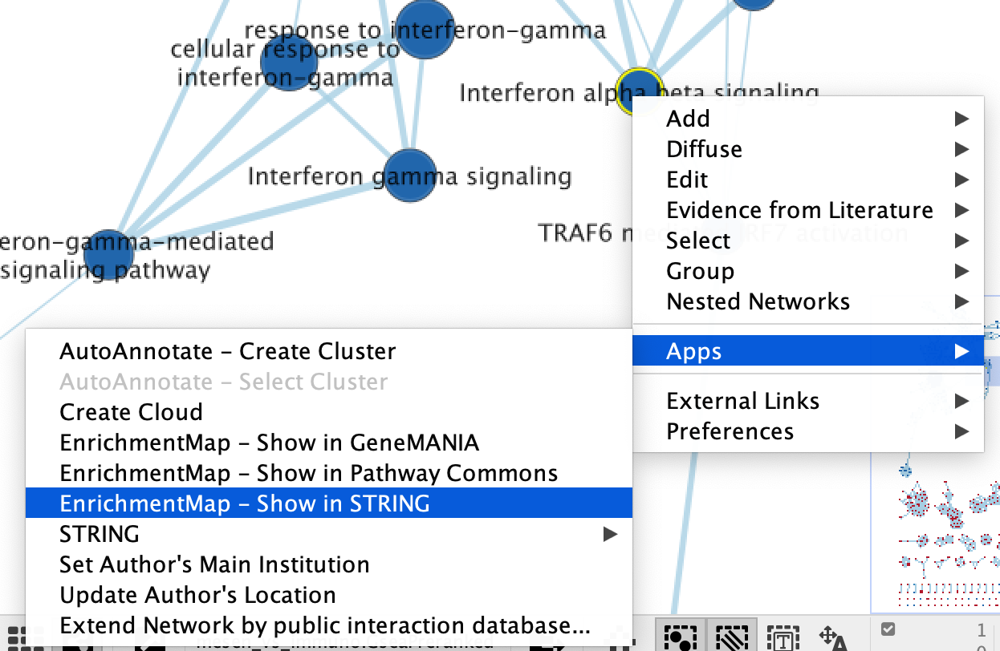</p>

   * Right click on selected node/nodes.
   * Select *Apps* --> *EnrichmentMap - Show in STRING*
   * A *STRING Protein Query* panel will show up for the user to adjust query parameters.

<p align="center"> 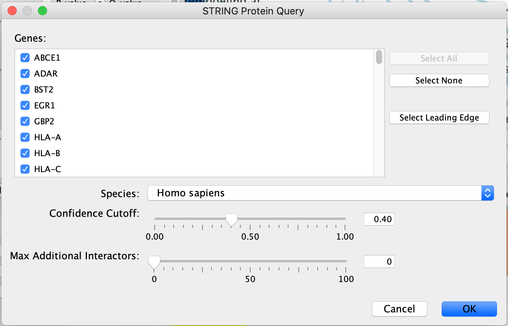</p>

  * *Genes* - The genes are pulled from all the selected nodes.  You can choose to change the selection to a subset of genes in the set by unclicking specific genes.  
  * If available, clicking on "Select leading edge" will limit the gene selection to just genes in the leading edge for the selected gene set.  Option will only be available for GSEA results where only a single gene set is selected.
  * *Organism* - select organism genes are associated with.
  * *Confidence cutoff* - the STRING algorithm looks for interactions between the query set. Different interactions have different confidence scores depending on many different factors (experiment through which it was found, number of publications associated with it ....).  By default, the confidence cutoff is set to 0.40.  To decrease the number of interactions returned, and include only high confidence interactions you can increase this threshold.  The inverse, decreasing the cutoff, will return more interactions.
  * *Max Additional Interactors* - If you want to add interactors in addition to your query you can specify the number of interactors you want STRING to return.  
  
<p align="center"> 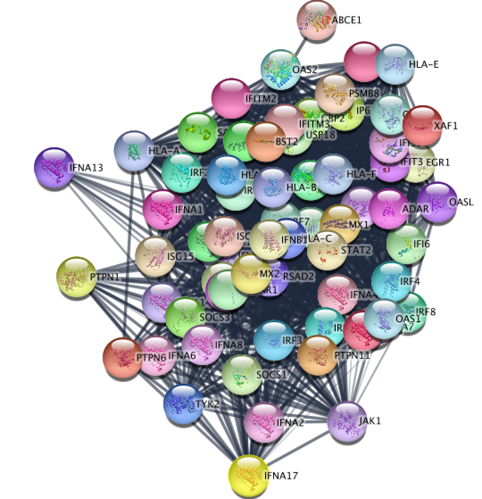</p>  
Resulting STRING network using the genes from the selected node "Interferon alpha beta signaling".  

## Update STRING visual style
  * You can change the visual properties of STRING network through the panel created by Enrichment map.
<p align="center"> 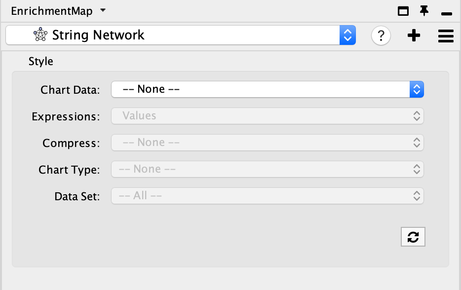</p> 
  * By default, the STRING network has the default STRING style. There is a lot of information embedded in this view.  See [here](https://jensenlab.org/training/stringapp/) for a tutorial on using STRING.
  * Adjust style with Enrichment Map expression data using the panel.  The panel contains the similar features that are available in the Enrichment Map heatmap panel.
    * Chart Data - choose to colour by dataset or by expression data.
    * Expressions - if chart data is set to 'Color by Expression Data' choose from Values, Row Norm or log values.
    * Compress - if chart data is set to 'Color by Expression Data' choose from Class: Median, Class: Min, Class: Max, Dataset: Median, Dataset:Min, Dataset: Max, or None
    * Chart type - if chart data is set to 'Color by Expression Data' choose from Radial HeatMap or Heatstrips.
    * Data Set - if there are multiple datasets choose which dataset to colour by. 
<p align="center"> 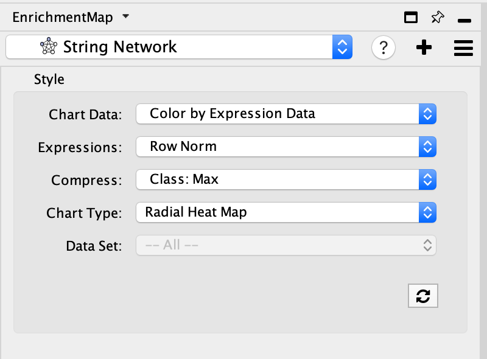</p> 

<p align="center"> 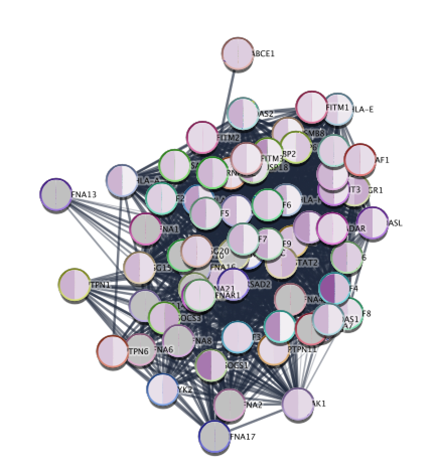</p>  
Resulting STRING network using the genes from the selected node "Interferon alpha beta signaling" after colouring the STRING network with expression data from Enrichment Map.

```{block, type="rmd-tip"}
If you want to return to your Enrichment map

  * click on the drop down in the top of the Control panel and 
  * By default, the STRING network will be named String Network.  For each new search a number will be added to the end of the name. You can manually change the name of the network by right clicking on the network name and selecting *Rename* in the Network Panel. 
  * jump back to the original enrichment map by selecting it from the drop down list.(For our example, click on mesen_vs_immuno.GSEAPreRanked to go to the original network.) 

<p align="center"> 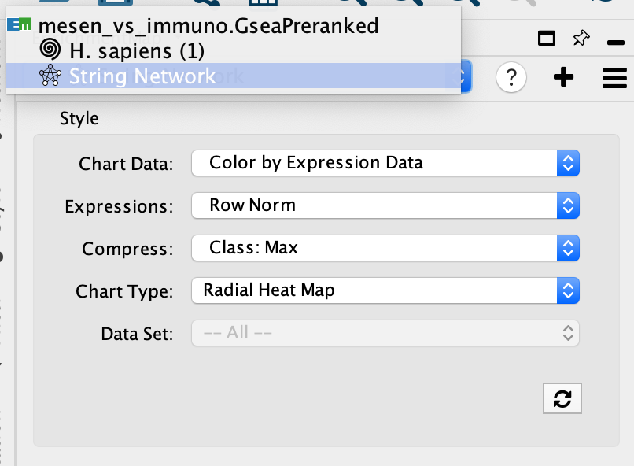</p> 
```    

## Explore STRING network  

STRING[@string] returns the inter-connected network of query genes connected based on the interactions and associated scores pulled from the [STRING database](https://string-db.org/). The returned STRING network has the typical STRING "glass" look style which can be easily adjusted using the option in the STRING panel (on the right hand side).

<p align="center"> 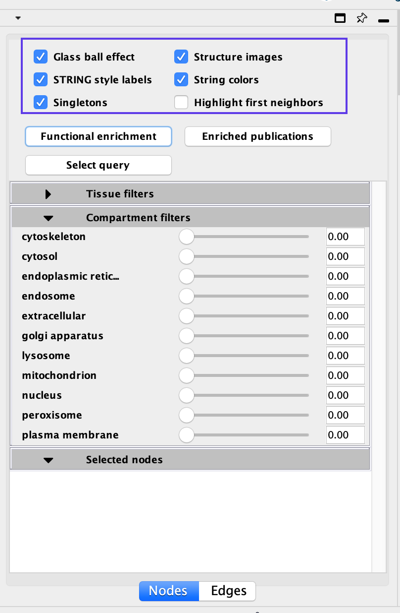</p> 

Disabling all visual properties will generate a simple network

<p align="center"> 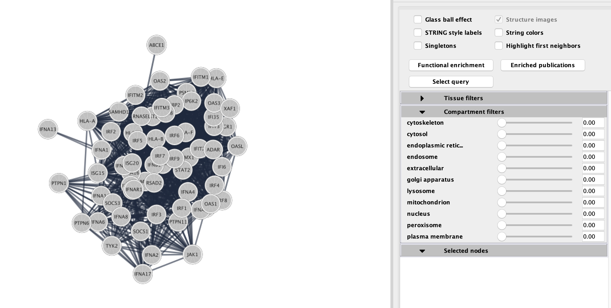</p> 

### STRING Enrichments

Eventhough the network was created from an enrichment analysis, STRING allows you to run an enrichment analysis on all or some of the genes in the network.  There are two types of enrichments available:

<p align="center"> 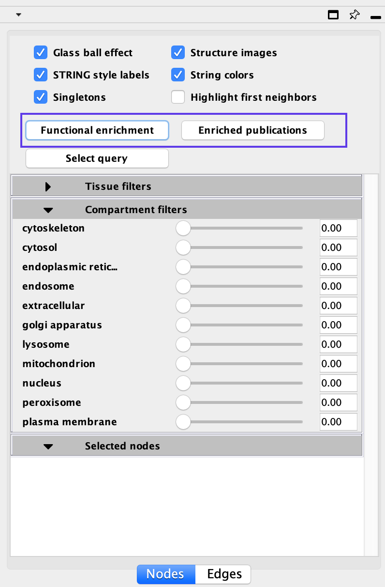</p>

  * *Functional Enrichments* - genes in the STRING network that are enriched in annotations from GO Biological process, GO molecular function, GO cellular component, Reactome pathway, KEGG pathway, Interpro domains, SMART domains, and Uniprot Key words
    * Click on Functional Enrichment
    * <p align="center"> 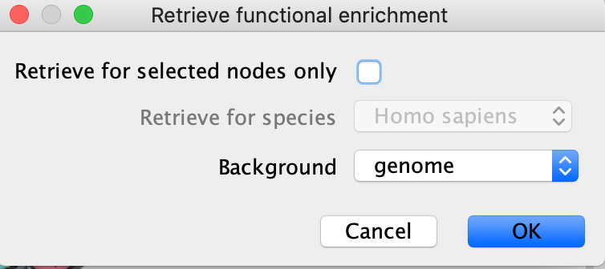</p>
    * If you want to restrict to just the selected node then click on "retrieve for selected nodes only"
    * You can also choose to use different background sets for the functional enrichment test, the entire genome, or limit it to the genes in the network.
    * Click on OK.
    * Enrichment results will appear in the Table browser.
    * <p align="center"> 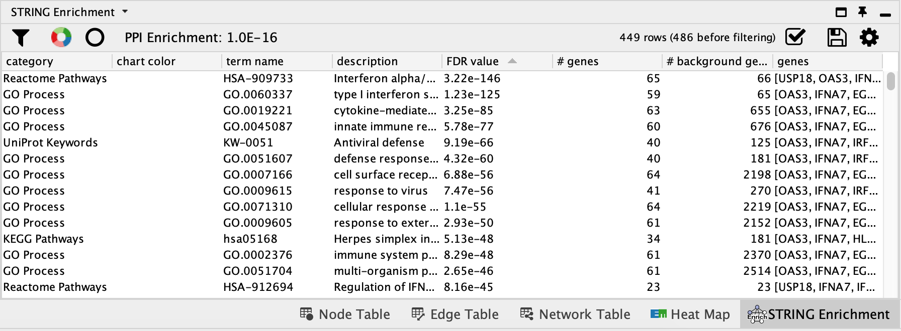</p>   
  * *Enriched Publications* - genes in the STRING network that are enriched for a given publication.
    * Click on Enriched Publications
    * <p align="center"> </p>
    * If you want to restrict to just the selected node then click on "retrieve for selected nodes only"
    * You can also choose to use different background sets for the functional enrichment test, the entire genome, or limit it to the genes in the network.
    * Click on OK.
    * Enrichment results will appear in the Table browser.
    * <p align="center"> 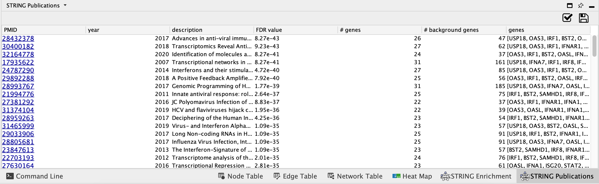</p>   

### STRING filtering

STRING offers interesting annotations and filter options.  You can filter your results by:

<p align="center"> 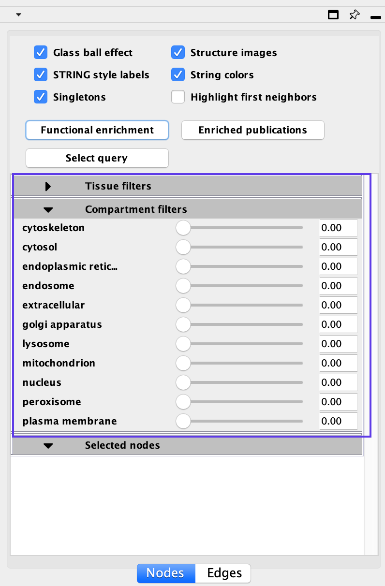</p>

  * Tissue types
  * Cellular location
  
Moving the sliders for each defined tissue type or cellular location will limit the genes in the network to just the genes that are more strongly associated with the given term.  For example, if you want to highlight genes found in the nucleus move the slider next to the nucleus term.  Scores associated with each of these can also be found in the Node Table. 

### STRING selected

Selecting an individual gene or a group of genes will populate the **Selected** pane with additional information about all the genes selected

<p align="center"> 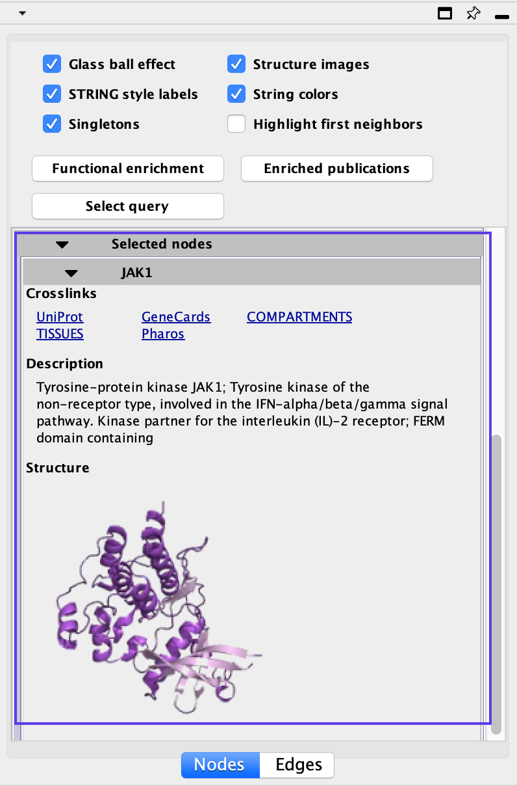</p>