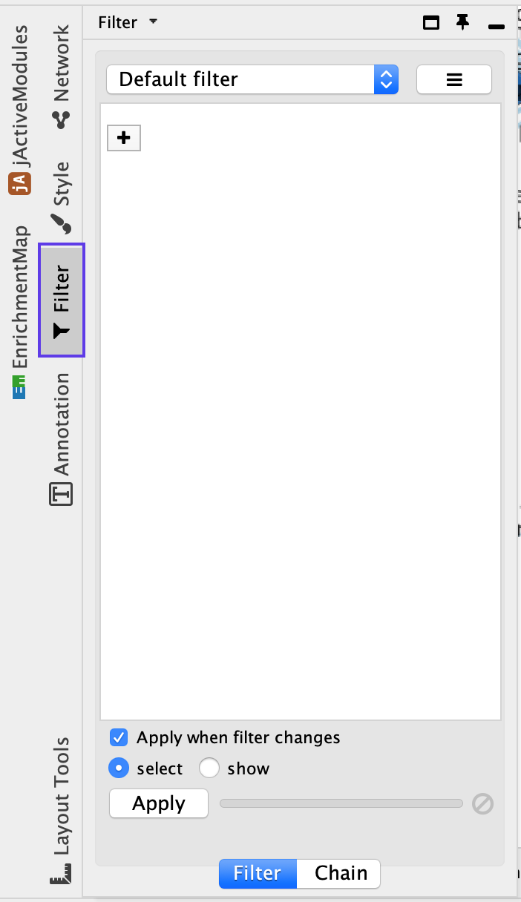

# (13B) Organization and clarification of the network

  i. If the network has too many nodes, go to the *EnrichmentMa*p tab in the Control Panel and use the *Node Cutoff Q-value* threshold slider. Adjusting to a numerical value closer to 0 will remove less significant nodes.
  <p align="center"> </p>
  
<ol start=2 type="i">
<li>If the network is too interconnected, go to the *EnrichmentMap* tab in the Control Panel and increase the *Edge Cutoff (Similarity)* threshold; this will remove connections between less related nodes</li>
</ol>

<p align="center"> </p>

<ol start=3 type="i">
<li>Apply the network layout again after adjusting the cutoffs (see the Layout menu in Cytoscape). The default layout algorithm is the unweighted Prefuse Force Directed layout. We also recommend that the prefuse force-directed layouts be weighted using the gene set similarity coefficient. Alternative layout algorithms are available and we encourage experimentation with them.</li>
</ol>  

```{block, type="rmd-tip"}
There are many different layout algorithms available in Cytoscape that can be used for EnrichmentMap. We recommend using an edge-weighted layout, which considers the overlap score between pathways. Most layouts (except yFiles) offer the ability to organize just the selected nodes. Experiment with different layouts to see which works best with your data. If you do not like the resulting layout, press command-z on macOS or Ctrl-z on Windows or click on Edit → Undo to revert to the previous view.
```

<ol start=4 type="i">
<li>To restore nodes or edges, adjust the threshold sliders to their original positions.</li>
</ol>  

## Separate two different phenotypes

<ol start=5 type="i">
<li>It can be helpful to separate two different phenotypes (i.e., place all the red nodes to one side and all the blue nodes to the other). To do this, go to the *Filter* tab in the Control Panel.</li>
</ol> 

<p align="center"> </p>

<ol start=6 type="i">
<li>Click on the ‘+’ symbol and select Column filter.</li>
<li>Click on Choose column… and select ‘Node: NES (Mesem_vs_Immuno.GseaPreranked)’.</li>
<li>Click on the box next to between and change the value to 0. Click Apply at the bottom of the panel.</li>
<li>All red nodes should now be selected. Click and hold on any selected node and drag selection to the left until it does not overlap any blue nodes.</li>
<li>Select Layouts from the Cytoscape menu and apply Prefuse Force Directed Layout → Selected Nodes Only → (none).</li>
</ol> 

<p align="center"> </p>

<ol start=11 type="i">
<li>Go back to the Control Panel *Filter*tab and adjust the slider to select all negative values. Click on Apply at the bottom of the *Filter* tab.</li>
<li>All blue nodes should now be selected. Click and hold on any selected node and drag selection to the right until it does not overlap any red nodes.</li>
<li>Select Layouts from the Cytoscape menu bar and apply Prefuse Force Directed Layout → Selected Nodes Only → (none).</li>
</ol> 

<p align="center"> </p>


