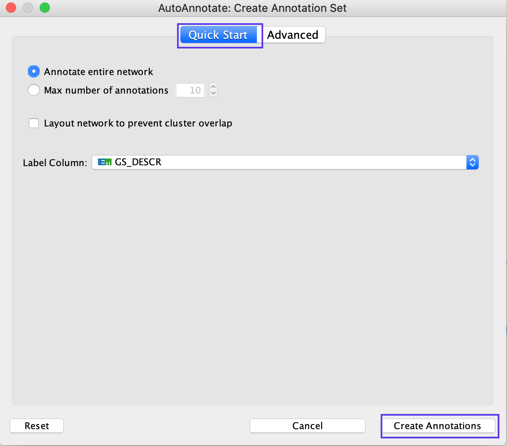
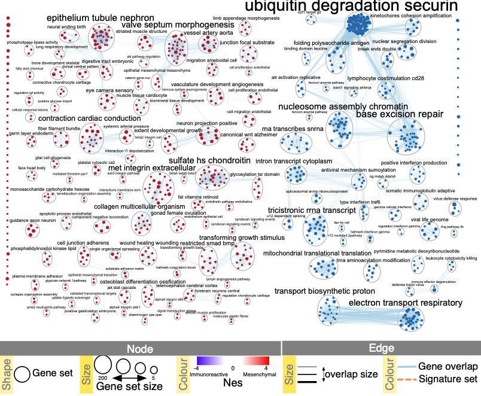

# (13C) Defining major biological themes {#annotate}

Enrichment maps typically include clusters of similar pathways representing major biological themes. Clusters can be automatically defined and summarized using the AutoAnnotate Cytoscape application. [AutoAnnotate](http://apps.cytoscape.org/apps/autoannotate) [@autoannotate] first clusters the network using the [clusterMaker2](http://apps.cytoscape.org/apps/clustermaker2) [@clustermaker] application and then summarizes each cluster on the basis of word frequency within the pathway names via the [WordCloud](http://apps.cytoscape.org/apps/wordcloud) [@wordcloud] app.

## Annotate the Network

<ol start=1 type="i">
<li>From the Cytoscape menu bar, launch AutoAnnotate by selecting *Apps → AutoAnnotate → New Annotation Set…*.  </li>
</ol>

The AutoAnnotate: Create Annotation Set panel will appear.

<ol start=2 type="i">
<li>In the *Quick Start* tab, click on *Create Annotations*. </li>
</ol>

<p align="center"> </p>

```{block, type="rmd-tip"}
The default parameters are likely to work well with EnrichmentMap; however, there are many parameters within the AutoAnnotate application that can fine-tune the results. See the AutoAnnotate user manual at https://autoannotate.readthedocs.io/en/latest/
```

<ol start=3 type="i">
<li>Each cluster in the network will have a circle annotation drawn around it and will be associated with a set of words (by default three) that correspond to the most frequent node labels in the cluster. These words are automatically selected and often must be manually renamed. Moving individual nodes within a cluster will automatically resize the surrounding circle and moving an entire cluster will redraw the surrounding circle in the new cluster location.</li>
</ol>

```{block, type="rmd-troubleshooting"}
**Node names contain uninformative words that are not excluded by default or are not considered during network normalization**

If particular non-informative words keep appearing in the labels generated by AutoAnnotate, try adjusting the WordCloud normalization factor. The significance of each word is calculated on the basis of the number of occurrences in the given cluster of pathways. This causes frequent words such as ‘pathway’ or ‘regulation’ to be prominent. By increasing the normalization factor, we reduce the priority of such recurrent words in cluster labels. If that doesn’t help, you can add the non-informative words to the WordCloud word exclusion list

  * Click on Apps -> Word Cloud -> Show Word Cloud
  * Navigate to Word cloud input panel in Cytoscape Control Panel
  * adjust normalization constant slider bar.
  * In the *AutoAnnotate input panel*, click on the menu button (icon with three horizontal lines). Select *Recalculate Labels…* for this change to take effect
  
Alternately, you can add the offending words to word cloud ignore list. 
  * Click on Apps -> Word Cloud -> Show Word Cloud
  * In the *WordCloud input panel*, expand Advanced options.
  * Click on *Excluded words...*
  * type offending words into text box
  * Click on *Add*
  * Repeat for all words you would like remove
  * Click on *OK*
  * In the *AutoAnnotate input panel*, click on the menu button (icon with three horizontal lines). Select *Recalculate Labels…* for this change to take effect
```

```{block, type="rmd-troubleshooting"}
**Labels contain ‘-’**

If a specific character other than a space is used to separate words (e.g., ‘-’ or ‘|’), it should be added as a delimiter in the WordCloud application. 

  * Launch the WordCloud application (Apps → WordCloud). 
  * In the *WordCloud input panel*, expand Advanced options. 
  * Click on *Delimiters…* 
  * Add your delimiters. 
  * Click on OK. 
  * In the *AutoAnnotate input panel*, click on the menu button (icon with three horizontal lines). Select Recalculate Labels… for this change to take effect
```

## Manually arrange network

<ol start=4 type="i">
<li>Manually arrange clusters to clean up the figure. Move nodes to reduce node and label overlap.  </li>
</ol>

```{block, type="rmd-troubleshooting"}
**Labels are bigger for bigger clusters, but user wants all the labels to be the same size**

The number of nodes in a cluster determines label size by default. Thus, the cluster size may relate to pathway popularity instead of importance in the experiment. Annotation labels can all be set to the same size by unchecking the option *Scale font by cluster size* in the *AutoAnnotate results panel*.

```

## Resulting Network

<p align="center"> </p>

Publication-ready enrichment map created with parameters FDR Q value < 0.01, and combined coefficient >0.375 with combined constant = 0.5. Red and blue nodes represent mesenchymal and immunoreactive phenotype pathways, respectively. Nodes were manually laid out to form a clearer picture. Clusters of nodes were labeled using the AutoAnnotate Cytoscape application. A legend was manually added at the bottom of the figure.
