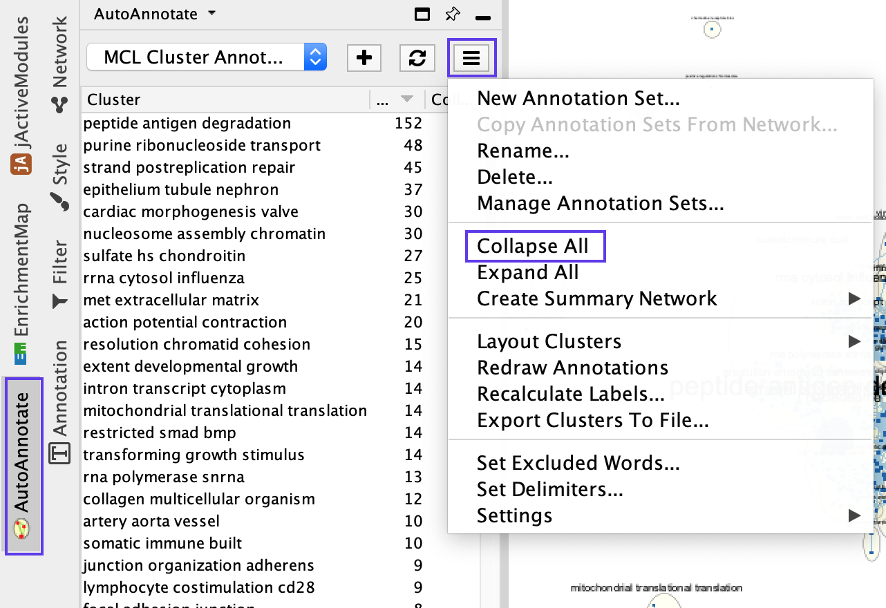
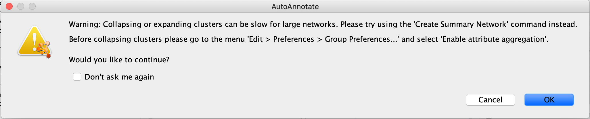
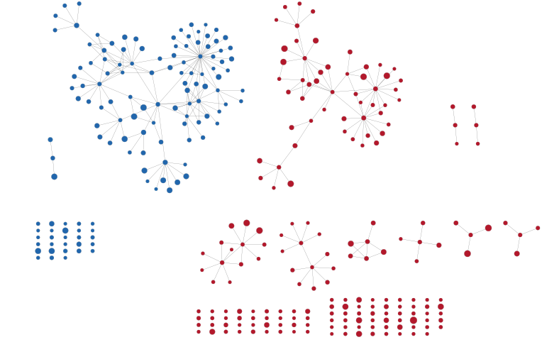
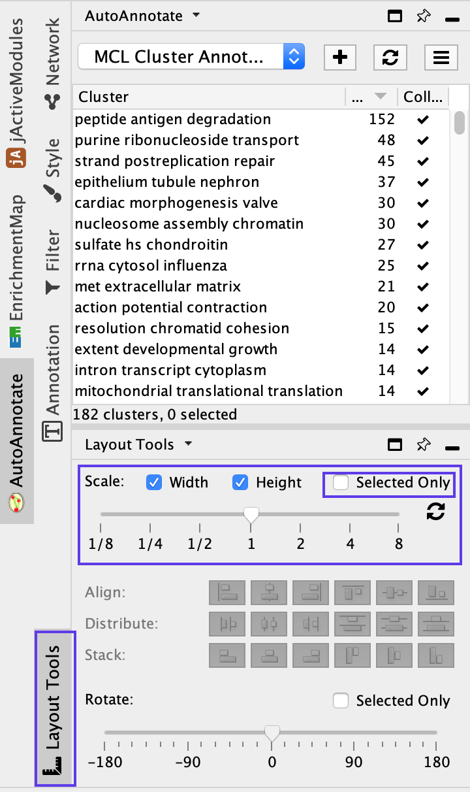

# (13D) Creation of a simplified network view

This creates a single group node for each cluster with a summarized name and provides an overview of the enrichment result themes that is useful for enrichment maps containing many nodes.

## Collapse Network

<ol start=1 type="i">
<li>In the *Control Panel*, select the *AutoAnnotate* tab.</li>
<li>Click on the *Menu* icon in the upper right corner.</li>
<li>Select *Collapse All*.</li>
</ol>

  <p align="center"> </p>
  
```{block, type="rmd-troubleshooting"}
**Pop-up after selecting Collapse all shows up every time user collapses the clusters**

Once you click on Collapse All, a pop-up window will show the message ‘Before collapsing clusters please go to the menu Edit → Preferences → Group preferences and select ‘Enable attribute aggregation’’. 

  <p align="center"> </p>

  * There is no need to adjust this parameter repeatedly. 
  * Click on Don’t ask me again and OK if you have set this parameter previously.
```


```{block, type="rmd-troubleshooting"}
**Collapsing the network takes a long time**

For large networks, collapsing and expanding may take time. For a quick view of the collapsed network, you can create a summary network by selecting the *Create summary Network…* option. There are two options for the summary network: clusters only, which creates a summary network with just the circled clusters, or clusters and unclustered nodes, which creates a summary network that also includes the singleton nodes that are not part of any cluster
```

```{block, type="rmd-troubleshooting"}
**Collapsed network contains gray nodes instead of colored nodes as they were in the pre-collapsed network**

If the nodes in the resulting collapsed network are gray, then you forgot to enable attribute aggregation. 

  * Expand the clusters and, 
  * before collapsing clusters again, go to Edit → Preferences → Group preferences and 
  * select Enable attribute aggregation
  * Now, Select *Collapse all* to collapse network.
```

<p align="center"> </p>  

The enrichment map was summarized by collapsing node clusters using the AutoAnnotate application. Each cluster of nodes s now represented as a single node. 

## Scale Network

Scale the collapsed network for better viewing.

<ol start=4 type="i">
<li>In the Cytoscape menu bar, select *View → Show Tool Panel*.</li>
<li>Go to the *Layout Tools* panel located at the bottom of the Control Panel.</li>
<li>Locate the *Scale* slider bar and use it on unselected nodes (uncheck *Selected only*).</li>
<li>Move the slider left to tighten the node spacing. Close the Node Layout Tools panel when finished.</li>
</ol>

  <p align="center"> </p>


  