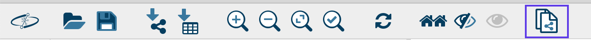
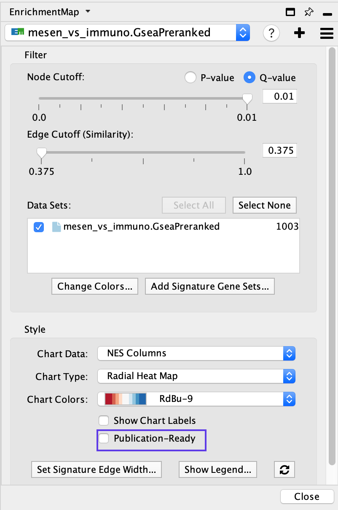

# (13E) Manual arrangement of network nodes and updating of theme labels

This section is required for the clearest network view and for a publication-quality figure. For instance, it is useful to bring together similar themes, such as signaling or metabolic pathways, even if they are not connected in the map. Use of space should be optimized so that large amounts of white space are not present. This is a time-consuming step, but the more effort spent, the higher the quality of the resulting figure will be.

## Create Sub-network
i. If the focus of the figure is only on a subset of the network, it can be easier to work with just the subset. To create this, 
  * select the nodes of interest, 
  * then in the Cytoscape menu bar select *File → New → Network → From selected nodes → all edges*,
  * or alternatively use the corresponding icon in the Cytoscape tools menu bar (*New network from selection → all edges*).
    <p align="center"> </p>


## Publication ready
<ol start=2 type="i">
<li>When the purpose of the figure is to show a large network and highlight only the main themes, click on Publication ready, located at the bottom of the EnrichmentMap in the Control Panel to remove node labels. To revert to the original network, click on the Publication ready button again.</li>
</ol>

  <p align="center"> </p>
  
```{block, type="rmd-troubleshooting"}
**In the EnrichmentMap input panel, the bottom options Publication Ready and Set Signature Edge Width are not visible**

Close the *Layout Tools* window clicking on the *Layout Tools* icon in the side menu.
```

## Rename themes
<ol start=3 type="i">
<li>Rename the theme names generated by AutoAnnotate to better explain groups of pathways.</li>
</ol>

 Automatic WordCloud-generated theme names are useful for quickly exploring an enrichment map, but frequently need to be renamed for publication-quality figures. Naming should carefully consider all pathways and genes within each theme. 
 
  * Themes can be renamed in AutoAnnotate by right-clicking the name in the AutoAnnotate panel in the ‘Cluster’ column, and selecting *Rename…* 
  * Alternatively, labels can be changed in external drawing software (follow Steps 14–16 to export a file to use in external drawing software). 
  * Note that re-clustering the network will reset the theme names.