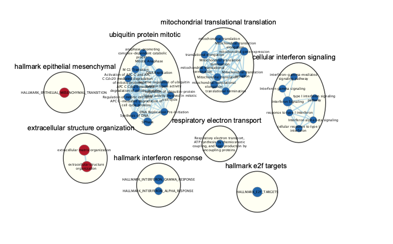
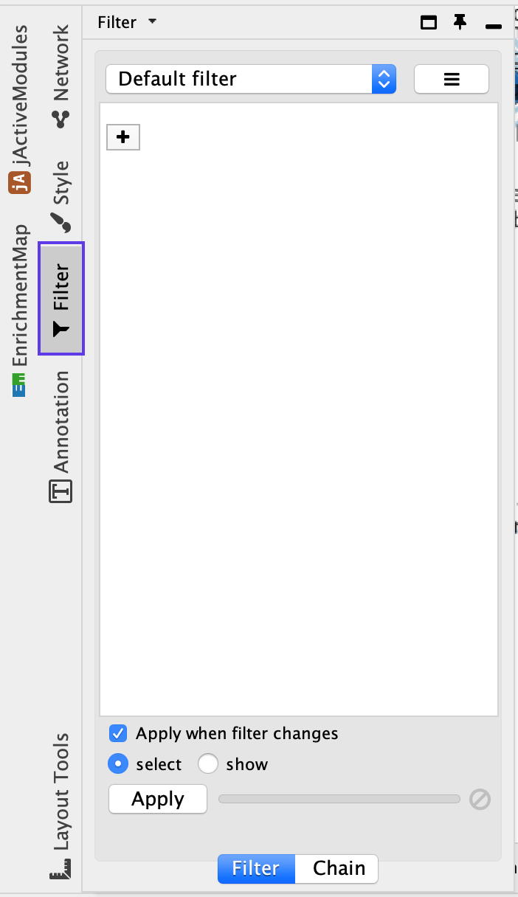

# (13F) Creation of a subnetwork that highlights a specific theme subset

Enrichment maps of rich omics datasets are often large and complicated, and it is often useful to emphasize specific themes or relevant pathways in a final figure. For example, we will select the top mesenchymal and immunoreactive pathways and create a subnetwork for detailed visualization.

<p align="center"> </p>

Subnetwork of the main enrichment map was manually created by selecting pathways with the top NES values and creating a new network from the selection. Red and blue nodes are mesenchymal and immunoreactive phenotypes, respectively. Clusters of nodes were automatically labeled using the AutoAnnotate application. Annotations in the subnetwork may differ slightly from those in the main network, as word counts were normalized on a network basis.

<ol start=1 type="i">
<li>Click on the *Filter* tab in the Control Panel </li>
</ol>

<p align="center"> </p>

<ol start=2 type="i">
<li>Click on the ‘+’ symbol and select Column filter.</li>
<li>Click on Choose column… and select ‘Node: NES (Mesem_vs_Immuno.GseaPreranked)’.</li>
<li>Click on the box next to between and replace the negative value with ‘2.5’. Do not change the positive value next to inclusive. Click Enter.</li>
<li>Click on the ‘+’ symbol and select Column filter.</li>
<li>Click on Choose column… and select ‘Node: NES (Mesem_vs_Immuno.GseaPreranked)’.</li>
<li>Click on the box next to inclusive and change the value to ‘-2.5’. Do not change the negative value next to between. Click Enter.</li>
<li>Above the two column filters you just added, change the dropdown option from Match all (AND) to Match any (OR).</li>
<li>Click on *Apply*. Under the Apply button, it should display the number of nodes and edges selected. In this example, 37 nodes should be selected.</li>
<li>From the Cytoscape menu, choose *Select File → New → Network → From selected nodes, all edges.* or click on the button in the menu bar</li>
</ol>

<p align="center"> </p>

```{block, type="rmd-troubleshooting"}
**The created subnetwork is empty**

Make sure that the nodes that will be part of the subnetwork are selected before creation of the subnetwork
```
    
<p align="center"> </p>

<ol start=11 type="i">
<li>A new, smaller network should appear. Manually move nodes around to optimize the layout. </li>
<li>Annotate the network as described in [Step 13C](#annotate)</li>
</ol>
