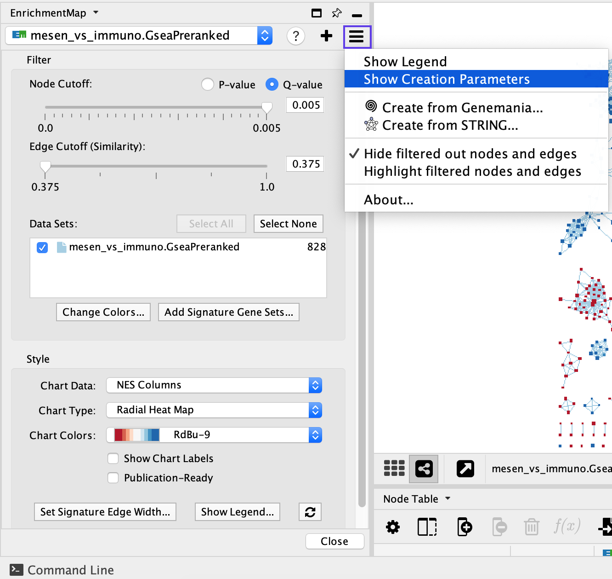
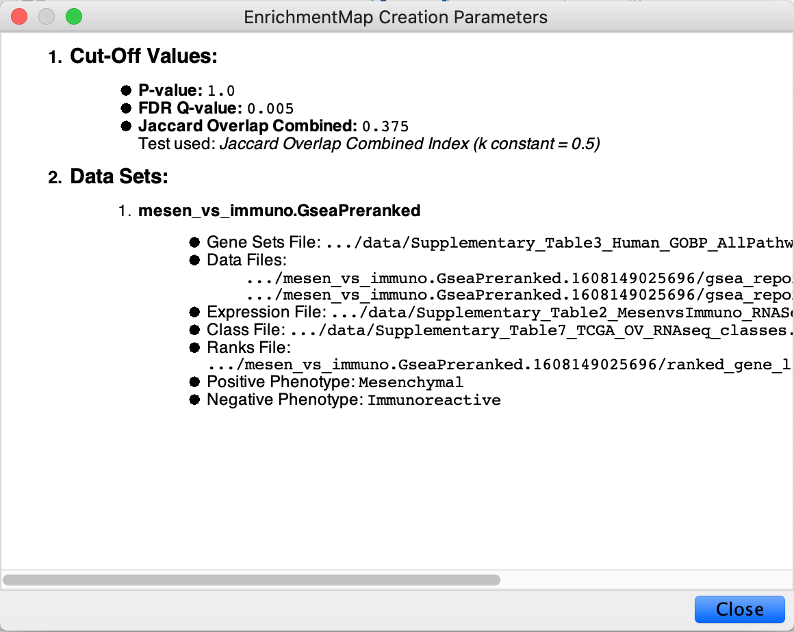
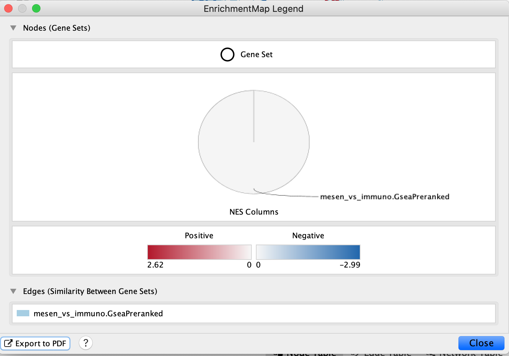

# (14 - 20) Exporting figures, creating legends and saving work

## Export image

<ol start=14 type="1">
<li>Export network as image. </li>
</ol>

  * In the Cytoscape menu bar, select *File → Export as Image…*
  * Set the *Export File Format* to PDF (*.pdf).

Vector-based PDF and SVG formats are recommended for publication-quality figures because they can be zoomed without losing quality. Either file type can be edited using software packages such as Adobe Illustrator or Inkscape. The PNG file format is recommended for high-quality online images, whereas the JPG format is not recommended because it may lead to visual artifacts due to lossy compression.

```{block, type="rmd-troubleshooting"}
**Exported image contains only a small subset of the network**

In image export, only the visible part of the map will be exported. Make sure that the entire network is visible on your screen before exporting
```

## Save Network

<ol start=15 type="1">
<li>Click on *Browse…* to specify file name and location.</li>
<li>Click on *Save* to close the browser window and then on *OK*.</li>
</ol>

## Network creation parameters

Identify network creation parameters. In the previous step, we exported the network as an image, but the parameters used to create the map are needed to interpret and reproduce the image. 

<ol start=17 type="1">
<li>In the *Control Panel*, locate the *EnrichmentMap* input panel and click on the menu icon in the top right-hand corner.</li>
<li>Click on Show Creation Parameters. </li>
</ol>

<p align="center"> </p>

  * In the displayed panel, you will find the FDR Q value, similarity metric and threshold parameters to be added to the text legend of figure. In this example: ‘Enrichment map was created with parameters q < 0.01, and Jaccard Overlap combined coefficient > 0.375 with combined constant = 0.5’
  
  <p align="center"> </p>
  
```{block, type="rmd-tip"}
The EnrichmentMap Creation Parameters panel shows only the parameters that were used at network creation. If you modified the network using filters or the EnrichmentMap slider bars, you will have to update the thresholds accordingly. 
```

## Legends

<ol start=19 type="1">
<li>Show and create a legend. </li>
</ol>

  * In the *Control Panel*, locate the EnrichmentMap input panel and click on the menu icon in the top right corner. 
  * Click on *Show Legend*. 

 <p align="center"> </p>
  
  
  The example shows a simplified legend; however, many different node and edge attributes, such as size, shape and color, can be used in the enrichment map to represent different aspects of the data. It is important to describe them in the text associated with the figure or in the figure itself as a legend. The basic legend components (available as SVG and PDF images at http://baderlab.org/Software/EnrichmentMap#Legends) that can be used for an enrichment map figure. You can manually select the components relevant to your analysis.
  
## Save

<ol start=20 type="1">
<li>Save all work as a Cytoscape session. </li>
</ol>

  * In the Cytoscape menu, select *File → Save As…*
  * Navigate to the directory in which you wish to save the session and specify the desired file name.
  
  
